# refactor: Unify recording and refinement hotkey gestures

## Goal Capsule

Replace the independent refinement hotkey with terminal gestures on the configured recording hotkey. Preserve existing recording safety semantics, modifier-only support, screenshot processing, and cancellation. Do not modify the user's unrelated refinement-copy change or its changeset.

## Product Contract

### Summary

Hex uses one configured recording hotkey. The normal gesture starts a baseline recording. A first activation followed by a held second activation starts a screenshot-aware recording. At the end of a locked recording, a quick activation completes normally and a held activation requests refinement.

### Problem Frame

Two independent hotkey processors allow a refinement shortcut to leak state into a later normal recording. The start shortcut also selects refinement too early, making the behavior difficult to reason about.

### Requirements

- R1: Remove the separately configurable refinement recording hotkey and its independent gesture settings.
- R2: Keep the configured recording hotkey as the sole recording entry point. Its normal configured gesture starts a baseline recording.
- R3: A first activation followed by a held second activation starts screenshot-aware recording and captures its screen context at activation time.
- R4: Screenshot-aware recording always enters the refinement pipeline when completed, irrespective of the ending gesture.
- R5: For a locked recording, a normal end activation completes without refinement; a held end activation completes with refinement.
- R6: A completed or cancelled recording clears all gesture state, so a preceding session can never change which gesture stops the next session.
- R7: Preserve Esc cancellation, modifier-only protections, timing thresholds, and existing screen-capture failure behavior.
- R8: Retire selected-text capture that is reachable only through the removed voice refinement shortcut; preserve the independent selected-text menu-bar command.
- R9: Screenshot-start and held terminal-refinement gestures are available only for double-tap locked recordings. Press-and-hold configurations retain baseline recording unchanged.
- R10: If screen-aware activation is unavailable, the held-second gesture starts a baseline recording. If an activated capture fails, continue the already-started refinement without a screenshot and preserve the existing error/history signal.

### Scope Boundaries

- Do not change refinement providers, prompts, or the refinement processing contract.
- Do not change screen-capture permissions, model selection, or history behavior beyond the unified gesture source.
- Do not alter unrelated settings copy changes already present in the worktree.

---

## Planning Contract

### Key Technical Decisions

- KTD1: Express start, locked-end, and cancellation decisions in one `HotKeyProcessor` state machine rather than coordinating two processors.
- KTD2: Delay the locked-recording stop output until the ending activation is released, so its duration deterministically selects normal completion or refinement.
- KTD3: Represent screenshot-start and refine-end intent as explicit output/session metadata passed to `TranscriptionFeature`; screenshot intent wins over normal terminal intent.
- KTD4: Remove obsolete refinement-hotkey persistence via the existing settings migration/defaults path, rather than leaving a hidden second shortcut.
- KTD5: Use one 0.75-second threshold, clamped upward by the configured normal minimum key time, for both screenshot-start and held terminal-refinement classification. Durations below it stay normal.
- KTD6: Keep the threshold clock and cancellation identity in `TranscriptionFeature`, following the existing screen-aware activation effect. The processor exposes pending start/end holds and the reducer may act only while its matching gesture/session remains active. The start-threshold action latches screenshot/refinement intent before terminal release is processed; every later countdown or capture result must match that session token.

### High-Level Technical Design

```mermaid
stateDiagram-v2
    [*] --> Idle
    Idle --> BaselineRecording: configured normal start
    Idle --> ScreenshotRecording: first activation + held second activation
    BaselineRecording --> Locked: start activation released
    ScreenshotRecording --> Locked: screenshot captured; activation released
    Locked --> EndPending: configured hotkey pressed
    EndPending --> Idle: quick release / normal transcription (baseline) or refinement (screenshot)
    EndPending --> Idle: held release / refinement
    BaselineRecording --> Idle: Esc / cancel
    ScreenshotRecording --> Idle: Esc / cancel
    Locked --> Idle: Esc / cancel
```

### Assumptions

- The user's double-tap setup remains supported: ordinary double tap starts a locked recording; holding the second activation requests screenshot-aware start.
- Existing non-double-tap/press-and-hold configurations retain their established normal-recording semantics; screenshot-start and held terminal-refinement are intentionally unavailable until double-tap lock is enabled.

### Research

- Local history documents a previous two-processor handoff fix (`4f3da25`) and confirms that independent gesture trackers are the regression source.
- Existing screen-aware behavior already captures context at activation time; its gesture source moves to the normal processor.
- No relevant `docs/solutions/` guidance exists. External research is unnecessary because the codebase has direct state-machine and screen-aware patterns.

---

## Implementation Units

### U1. Model unified hotkey session intent

**Goal:** Give the sole `HotKeyProcessor` enough state and output information to distinguish screenshot start, normal locked completion, and held refinement completion without stale state.

**Requirements:** R2, R3, R5, R6, R7, R9.

**Dependencies:** None.

**Files:** `HexCore/Sources/HexCore/Logic/HotKeyProcessor.swift`, `HexCore/Tests/HexCoreTests/HotKeyProcessorTests.swift`.

**Approach:** Replace the lock-only long-press flag with explicit transition intent. Track a second-start hold independently from a terminal locked-recording hold; reset both on every idle/cancel/discard path. Preserve pure event classification in the processor and use the existing reducer-owned cancellable clock plus gesture/session identity for threshold activation. Keep existing dirty-chord and modifier-only handling unchanged.

**Execution note:** Add characterization coverage around current modifier-only and double-tap boundaries before reshaping transition outputs.

**Patterns to follow:** Existing `HotKeyProcessor.State`, `Output`, `resetToIdle`, and timing-window tests.

**Test scenarios:**

- A configured double tap starts one locked baseline session and a quick end activation selects normal completion.
- Holding the second activation after the first tap starts a screenshot-aware session.
- Holding the terminal activation of a locked baseline session selects refinement, while a quick terminal activation does not.
- Screenshot-aware start selects refinement for both quick and held ending activations.
- Esc, short invalid input, and a completed session clear all start/end hold state before the next recording.
- Modifier-only hotkeys retain their minimum duration, dirty-state, and double-tap-only behavior.

**Verification:** Unit-level event sequences show the expected output and reset to an idle processor after each terminal path.

### U2. Route unified intent through transcription and retire the secondary shortcut

**Goal:** Start screen-aware recording from the normal hotkey processor, choose refinement at completion, and remove the separate refinement processor/settings capture path.

**Requirements:** R1, R2, R3, R4, R5, R6, R7, R8, R9, R10.

**Dependencies:** U1.

**Files:** `Hex/Features/Transcription/TranscriptionFeature.swift`, `Hex/App/HexAppDelegate.swift`, `Hex/Features/Settings/SettingsFeature.swift`, `HexCore/Sources/HexCore/Settings/HexSettings.swift`, `HexCore/Tests/HexCoreTests/HexSettingsMigrationTests.swift`, `HexTests/RecordingRaceTests.swift`.

**Approach:** Collapse routing onto one active processor and pass terminal refinement intent to the transcription reducer. Configure the 0.75-second hold threshold from the normal recording setting and only schedule it for double-tap locks. Make screen-aware session metadata force refinement even when the terminal gesture is normal. An unavailable screen-aware configuration falls through to baseline recording; a capture failure after activation preserves the existing refinement-with-error behavior. Delete/refactor refined-hotkey state, selected-text capture state that only serves it, capture actions, defaults, and migration compatibility consistently so no second monitor remains active; retain the independent menu-bar selected-text action.

**Patterns to follow:** Existing forced-refinement, screen-aware activation, and recording cleanup/reset flows.

**Test scenarios:**

- A normal locked recording followed by a held terminal activation takes the refinement pipeline.
- A screenshot-start recording takes the refinement pipeline after both a quick and a held end activation.
- Ending one session cannot alter the next session's hotkey processor or completion route.
- Screen-capture success/failure preserves existing ordering and fallback behavior.
- Persisted settings containing retired refinement-hotkey fields load safely and no longer register a second recorder.
- A hold just below the threshold remains normal, while a hold at the threshold selects screenshot start or terminal refinement as applicable.
- Releases immediately before, at, and after the start threshold have deterministic baseline or latched-screenshot outcomes; late capture results after cancellation/completion are ignored.
- A press-and-hold configuration continues ordinary dictation without exposing an ambiguous screenshot/refinement completion gesture.
- Unavailable screen-aware activation falls back to baseline; post-activation capture failure preserves forced refinement and emits the existing error/history metadata.

**Verification:** Reducer/race coverage proves one processor owns a session from start through completion and all terminal cleanup clears active intent.

### U3. Simplify settings and document the gestures

**Goal:** Remove the obsolete refinement-hotkey controls and describe the one-hotkey behavior accurately.

**Requirements:** R1, R2, R3, R4, R5.

**Dependencies:** U2.

**Files:** `Hex/Features/Settings/RefinementSectionView.swift`, `docs/hotkey-semantics.md`, `README.md`, `.changeset/<generated>.md`.

**Approach:** Keep refinement provider and prompt controls, but remove the separate recording shortcut and its timing controls. Update user-facing semantics to make screenshot capture a held second-start activation and refinement a held terminal activation. Preserve unrelated uncommitted copy styling in `RefinementSectionView`.

**Test expectation:** none -- this unit is UI/documentation cleanup; behavior is covered by U1 and U2.

**Verification:** Settings presents a single recording shortcut, documentation matches the actual state machine, and a patch changeset describes the user-facing simplification.

---

## Verification Contract

- Inspect and extend the targeted `HotKeyProcessor`, settings-migration, and recording-race coverage described above.
- Run the unsigned Debug build specified in `AGENTS.md`.
- Do not run unit or Xcode test commands unless the user requests them; repository instructions make tests opt-in.
- Manually validate the gesture matrix in a local build when an accessible development environment is available: baseline start/end, screenshot start/normal end, screenshot start/refine end, baseline/refine end, and cancellation.

## Definition of Done

- One configured hotkey owns each recording session from start to completion.
- Screenshot-start recordings always refine; terminal holds request refinement for ordinary recordings.
- The separate refinement shortcut, monitor, and settings are retired without affecting provider configuration.
- State cannot leak from a refined or screenshot-aware session to the next baseline recording.
- The targeted behavior is covered, the Debug build succeeds, and a patch changeset is present.
