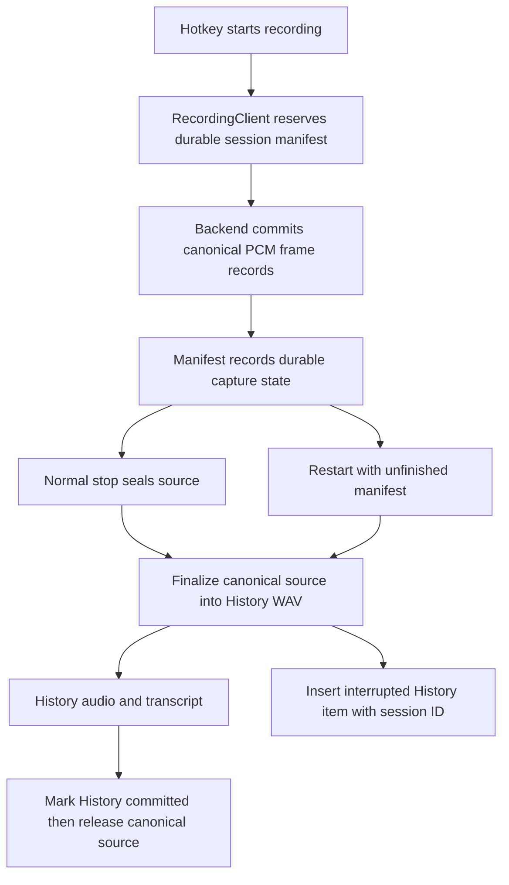

# Crash-Resilient Recording Recovery - Plan

## Goal Capsule

- **Objective:** Preserve an in-progress microphone recording from its first captured samples and make it recoverable after Octo restarts or terminates unexpectedly.
- **Authority:** The user request and repository guidance take precedence; preserve the existing recording semantics, history privacy setting, and user-owned working-tree changes.
- **Execution profile:** Implement with TCA dependency boundaries, file-system durability, and existing History persistence rather than introducing a database or network service.
- **Stop condition:** The canonical recording source is durable before normal transcription begins, normal stop and restart run the same finalization path, and source frames are removed only after their finalized History audio is durably committed or the user explicitly discards that session.

---

## Product Contract

### Summary

Octo currently writes active audio to the temporary directory and only moves it into durable History after `stopRecording()` returns.

This plan makes a durable, per-session canonical frame source the normal recording input and reconciles unfinished sessions at launch so a restart cannot silently discard the user's spoken work.

### Problem Frame

An app restart during an active recording occurs before the existing post-stop History checkpoint.

The current capture-engine WAV and fallback-recorder WAV therefore remain temporary, and termination cleanup tears down active capture without creating a recoverable History entry.

### Requirements

#### Durable active capture

- R1. Starting a recording creates a unique artifact under Octo-controlled Application Support storage before normal capture begins.
- R2. Every PCM buffer accepted by either capture backend is durably appended to the canonical recording source, whose format can be finalized into normal transcription audio and retained History audio after either a clean stop or an unclean process exit.
- R3. A buffer-producing fallback uses the same canonical frame contract rather than the shared temporary `recording.wav` path.

#### Recovery and user access

- R4. On launch, Octo detects unfinished recovery sessions, converts valid journaled audio into a playable recording, and inserts one recoverable History item per session without auto-transcribing or pasting it.
- R5. A recovered item identifies that transcription was interrupted while retaining the audio and any recovery diagnostic needed to explain it.
- R6. Recovery works when normal termination has closed the current file and when the process has exited without finalizing its active WAV header.

#### Ownership and privacy

- R7. A normal completed transcription retains existing checkpoint, history-limit, cancellation, and audio-retention behavior without duplicating audio or History rows.
- R8. A recovery artifact remains only until it has either been promoted to a recoverable History item or explicitly discarded; normal cleanup never deletes an active journal prematurely.
- R9. The recovery path is a narrow interruption safeguard: successful recordings still honor the user's history/audio-retention preference.

### Acceptance Examples

- AE1. While a standard recording is active, force-quitting Octo and launching it again shows one interrupted recording with playable audio in History; no text is pasted automatically.
- AE2. A regular stop followed by successful transcription produces one History item and leaves no recovery journal or duplicate audio file.
- AE3. A normal app termination during recording closes the active artifact, and the next launch exposes it as an interrupted recording.
- AE4. A capture-engine failure that uses the tap-based fallback still commits frames to the same durable source contract and does not overwrite another recovery session.

### Scope Boundaries

- In scope: active-audio durability, startup reconciliation, interrupted History entries, terminal ownership, and regression coverage.
- Out of scope: automatic background retranscription, automatic paste after recovery, cloud backup, changes to the user-facing history setting, and recovery of audio that Core Audio never delivered to Octo.

---

## Planning Contract

### Key Technical Decisions

- KTD1. **Make raw capture frames the canonical recording source.** A durable WAV path alone does not prove recovery after a hard exit because AVFoundation updates writable file headers on close. Each backend writes accepted frames into the same durable, header-independent session source from the first buffer. Normal stop and launch recovery both finalize that source directly into the WAV used for transcription and, when retained, History; the app does not maintain a shadow recording. Apple documents that `AVAudioFile.close()` controls when a writer's header updates and that `AVAudioRecorder.stop()` closes its file. ([AVAudioFile close](https://developer.apple.com/documentation/avfaudio/avaudiofile/close%28%29?language=objc), [AVAudioRecorder stop](https://developer.apple.com/documentation/avfaudio/avaudiorecorder/stop%28%29?language=objc))
- KTD2. **Use a versioned, stateful manifest in Application Support.** The manifest owns a stable recovery-session ID, canonical source and final-audio paths, format metadata, monotonic frame/byte totals, and transitions from `capturing` through sealing, final-audio readiness, durable History commitment, and source release. It is atomically published so startup can distinguish a torn update from an intact session.
- KTD3. **Make the recovery durability contract explicit.** Reserve and atomically synchronize the manifest before capture starts. For every accepted buffer, append a complete self-validating frame record, synchronize that record to disk, then atomically publish the manifest's next sequence/frame totals; this defines a zero-frame loss bound for buffers Octo accepts after start succeeds. The serialized capture-processing path must preserve order without blocking the audio callback. A reservation, append, short-write, permission, or capacity failure stops the session with clear feedback rather than silently continuing without the requested guarantee.
- KTD4. **Use one finalizer for active transcription and interrupted History.** Persist the recovery-session ID with every resulting History item so reconciliation is exactly-once. If History retention is enabled, the finalizer writes the WAV to its History destination before the checkpoint. If it is disabled, it writes a durable session-owned transcription input, keeps the canonical source through terminal transcription, and removes both after successful completion. An interrupted item retains playback and deletion controls, never becomes a pasteable “last transcript,” and never starts transcription or refinement automatically.
- KTD5. **Retain the canonical source until durable finalization succeeds.** Only the recording owner may delete its source frames. A new recording, cancellation, History trimming, and normal teardown must not cancel or delete a prior session's in-flight finalization. Startup validates the finalized artifact before source release and quarantines, rather than destroys, a malformed session.
- KTD6. **Replace the WAV-only recorder fallback with a minimal tap-based fallback.** A fallback must not weaken the recovery guarantee or create a WAV-only side path. Replace `AVAudioRecorder` recording with a minimal `AVAudioEngine` input-tap path that feeds the same canonical writer and metering contract while preserving the existing capture-engine's normal-start behavior.
- KTD7. **Treat interrupted recovery as an explicit retention exception.** A recovered item remains user-accessible even when ordinary History retention is disabled or at its limit, until the user explicitly deletes it. All journal and derived files remain app-private and have one visible owner whose deletion removes every copy.

### High-Level Technical Design

The canonical frame source is directional architecture guidance: normal and interrupted recordings both use it to remain independent from a WAV header that may not have been finalized during a crash.

### Assumptions

- An interrupted recording is accessible in History as audio, but it must not automatically transcribe, paste, re-run refinement, or become the “last transcript” after launch.
- Recovery is an explicit retention exception only for interrupted work, including when ordinary History retention is disabled or at its configured limit; successful recordings still honor existing retention behavior.
- The existing uncommitted post-stop checkpoint remains the handoff point for completed recordings and will be integrated rather than replaced.

### Sequencing

Implement durable capture before startup reconciliation so launch never discovers a format it cannot convert.

Finalize the same canonical source on normal stop and on launch, then release it only after the finalized audio and History ownership are durable.

---

## Implementation Units

### U1. Canonical session source, manifest, and capture journal

- **Goal:** Reserve the canonical recording source before capture and append every backend's PCM buffers in a reconstructible format.
- **Requirements:** R1, R2, R3, R6, R8.
- **Dependencies:** None.
- **Files:** `Hex/Clients/RecordingClient.swift`, `Hex/Clients/SuperFastCaptureController.swift`, `Hex/Features/Transcription/TranscriptionFeature.swift`, `HexCore/Sources/HexCore/StoragePaths.swift`, `HexCore/Sources/HexCore/RecordingRecoveryStore.swift`, `HexCore/Sources/HexCore/Models/TranscriptionHistory.swift`, `HexCore/Tests/HexCoreTests/RecordingRecoveryStoreTests.swift`.
- **Approach:** Define the recording contract before capture: atomically reserve a unique canonical source and manifest with schema version, session ID, sample format, canonical paths, sequence and frame counters, and explicit state. Change the recording-start boundary to return a typed success or failure result so `TranscriptionFeature` does not enter a false recording state when reservation fails. Both the normal capture engine and a minimal tap-based fallback feed accepted frames into the one header-independent source; the existing WAV becomes a finalization product, not a parallel live recording. For every accepted buffer, write and synchronize the frame record before atomically advancing manifest totals. Open/reserve, append, short-write, permission, or capacity failure stops capture, restores recording/sleep state, and presents a user-visible error. The finalizer writes the WAV directly to the durable History destination when retained, or to a durable session-owned transcription input otherwise.
- **Patterns to follow:** `StoragePaths` for app-owned directories, dependency clients for I/O seams, `HexLog.recording` with private file-path logging, and `SuperFastCaptureController`'s serialized processing queue for capture ownership.
- **Test scenarios:**
  - Starting a session produces one unique canonical source and manifest outside `temporaryDirectory`, while reservation failure leaves no active TCA recording state.
  - Appending several PCM buffers preserves frame order, format, frame totals, and the per-record durability commit order.
  - A torn final record is detected without invalidating the preceding complete prefix.
  - A second session cannot overwrite a first session's source or fallback destination.
  - Reservation, short-write, disk-full, and permission failures never leave an active recording falsely marked recoverable and surface the start or terminal failure to the user.
  - Forced interruption of either backend leaves enough canonical source data to finalize playable audio.
- **Verification:** File-system tests finalize the same source after both normal stop and simulated interruption, validate complete-record totals and zero-loss commit ordering, and retain the existing late-buffer stop protection.

### U2. Shared finalization and launch-time recovery promotion

- **Goal:** Run one idempotent finalization path for either a normally sealed source or one found unfinished at app startup.
- **Requirements:** R4, R5, R6, R8, R9.
- **Dependencies:** U1.
- **Files:** `HexCore/Sources/HexCore/RecordingRecoveryStore.swift`, `HexCore/Sources/HexCore/Models/TranscriptionHistory.swift`, `HexCore/Sources/HexCore/TranscriptPersistenceClient/TranscriptPersistenceClient.swift`, `Hex/Features/App/AppFeature.swift`, `Hex/Features/Transcription/TranscriptionFeature.swift`, `Hex/Features/History/HistoryFeature.swift`, `HexTests/RecordingRecoveryTests.swift`.
- **Approach:** Add one finalizer that validates only complete aligned source records, derives fixed app-owned locations from the session ID instead of trusting persisted paths, rejects links and unexpected file types, and either hands a final WAV to normal transcription or creates an interrupted History entry. When ordinary History retention is disabled, retain the source and session-owned transcription input only until the active terminal flow succeeds; an interruption promotes the same session as the explicit recovery exception. Persist the recovery-session ID with the History item, query both manifest and History ownership on every launch, mark History committed before source release, and retry safely after any crash window. Quarantine malformed or unreconstructable sessions non-destructively with an explicit user-deletable owner. Startup invokes this finalizer after shared History is available, without invoking transcription, refinement, pasteboard, or overlay presentation.
- **Patterns to follow:** TCA startup effects in `AppFeature`, `@Shared(.transcriptionHistory)` mutation and durable checkpoint insertion in `TranscriptionFeature`, and artifact cleanup in `HistoryFeature`.
- **Test scenarios:**
  - An unclean capture source becomes one playable interrupted History item on launch.
  - Normal stop finalizes the same source once into the History WAV used by transcription.
  - Relaunching again is idempotent and neither duplicates the History entry nor recreates final audio.
  - A corrupt manifest, unsupported schema, incomplete tail, traversal path, symlink, unexpected file type, or finalization failure is quarantined without deleting its only source and does not prevent remaining sessions from recovering.
  - Fault injection before and after final-audio creation, History checkpoint, manifest update, and source release followed by two launches yields one row, one owned audio artifact, and no orphan.
  - History-disabled or history-limited successful flows retain current cleanup behavior, while an interrupted session remains available for explicit recovery.
- **Verification:** Reducer tests prove normal and startup paths select the same finalizer; playback fixtures verify final audio opens; fault-injection tests demonstrate exactly-once promotion across every durable state transition.

### U3. Terminal ownership and successful-flow cleanup

- **Goal:** Seal the canonical source on orderly termination and release it only after its normal or interrupted owner is durable, unless the user explicitly discards that session.
- **Requirements:** R7, R8, R9.
- **Dependencies:** U1, U2.
- **Files:** `Hex/Clients/RecordingClient.swift`, `Hex/App/HexAppDelegate.swift`, `Hex/Features/Transcription/TranscriptionFeature.swift`, `Hex/Features/Settings/SettingsFeature.swift`, `HexTests/RecordingRaceTests.swift`, `HexTests/RecordingRecoveryTests.swift`.
- **Approach:** Make termination cleanup best-effort seal the active source while retaining its manifest for the next launch. Preserve the existing post-stop checkpoint and teach its success, cancellation, failure, History-limit, explicit-deletion, and History-disable paths to release the matching canonical source only after their durable owner is established. When ordinary History retention is disabled, successful terminal flows delete their session-owned source and transcription input without creating a retained History row; interrupted recovery rows remain visible until explicit deletion and are excluded from the setting's bulk cleanup. Distinguish terminal intent: explicit user discard can delete its session; orderly termination must retain it; and a stopped recording awaiting a checkpoint remains recoverable. Keep all release operations idempotent and scoped by session ID so a new recording cannot delete prior work.
- **Patterns to follow:** `RecordingClientLive.shouldIgnoreStopRequest`, cancellable finalization effects in `TranscriptionFeature`, and existing race tests that protect a finished capture from a later cleanup action.
- **Test scenarios:**
  - Normal termination during capture seals the active source and leaves one recoverable session.
  - Completed transcription produces one History row and removes only its own manifest/source.
  - A quick new recording cannot delete a prior session awaiting checkpoint promotion.
  - Cancellation, failed transcription, max-history eviction, explicit History deletion, and disabling ordinary History retention each remove only the artifacts they own.
  - Fallback recording sources stay distinct across consecutive sessions.
  - An interrupted item cannot be selected by last-transcript, paste, or refinement paths.
  - Explicit deletion removes all source, manifest, quarantined, and final-audio copies for that session, including recovered entries retained while ordinary History is disabled.
- **Verification:** Existing recording-race coverage continues to pass by inspection, and focused tests exercise artifact ownership across stop, restart, cleanup, user-discard, and recovery-retention interleavings.

### U4. Release note

- **Goal:** Document the user-visible recovery safeguard for the next release.
- **Requirements:** R1, R4.
- **Dependencies:** U1, U2, U3.
- **Files:** `.changeset/<generated>.md`.
- **Approach:** Create one patch changeset with a concise user-facing summary of interrupted-recording recovery. Include an issue reference only when one exists.
- **Test expectation:** none -- release-note metadata only.
- **Verification:** The changeset is recognized by the repository's changeset tooling and leaves release-version processing to the release workflow.

---

## System-Wide Impact

- **Data lifecycle:** Active speech moves from an ephemeral temporary file to one durable canonical source with versioned state transitions. Normal stop and restart finalize that source into session-owned WAV audio; successful history-disabled flows remove it after transcription, retained History flows checkpoint it, and interrupted flows create an explicit recovery entry. The source is released only after the applicable owner is durable or the user explicitly discards it.
- **Integrity:** Every accepted buffer has a defined durable-commit policy, source records carry monotonic sequence and frame totals, and finalization validates them before producing WAV audio. A malformed session is quarantined rather than converted into plausible corrupt audio or deleted.
- **Privacy:** Canonical source and final audio contain user speech. They remain app-private, use unified logging with private paths, have one visible owner, and are deleted together by explicit History artifact ownership. Interrupted recovery is an intentional retention exception with a user-deletable owner that the ordinary History-disable bulk cleanup preserves.
- **Startup:** Reconciliation runs after shared History loading and queries durable History ownership before retrying. Repeated launches and crashes at each finalization boundary must not multiply rows or artifacts.
- **Performance:** Canonical-source writes must not block or reorder the capture pipeline. The chosen commit cadence is part of the user-facing recovery guarantee and must be measured against the existing audio-clock boundary tests.

---

## Risks & Dependencies

- **Unfinalized audio headers:** A crash can leave a WAV unreadable. Mitigation: make source frames and format metadata canonical, validate complete records, and finalize the same source into WAV audio on normal stop or launch.
- **Frame loss or capture regressions:** Disk persistence may contend with audio processing. Mitigation: make the durability cadence explicit, preserve ordered capture ownership, stop rather than falsely guarantee recovery after a writer failure, and validate frame counts and stop-boundary behavior.
- **Artifact leaks or duplicate History:** A crash between final-audio creation and History persistence can orphan files. Mitigation: versioned manifest transitions, stable session IDs in History, fault injection at every transition, and idempotent launch reconciliation.
- **Corrupt or hostile canonical source:** A torn manifest, traversal path, or link can produce false audio or escape artifact ownership. Mitigation: derive locations from the session ID under fixed app-owned roots, reject links and unexpected file types, validate aligned records, quarantine non-destructively, and release source only after playable-artifact validation and durable History commitment.
- **History privacy regression:** Recovering every successful recording would violate the current setting. Mitigation: retain only interruption artifacts as an explicit, user-deletable exception; successful work retains the existing terminal cleanup behavior.
- **Dirty worktree overlap:** Current uncommitted `TranscriptionFeature` and `RecordingRaceTests` changes add post-stop checkpoints. Mitigation: integrate around that behavior without replacing or reverting it.

---

## Sources & Research

- `Hex/Clients/RecordingClient.swift` and `Hex/Clients/SuperFastCaptureController.swift` show that active capture currently targets `temporaryDirectory` and that the capture engine writes PCM frames while active.
- `Hex/Features/Transcription/TranscriptionFeature.swift` contains the current post-stop durability checkpoint, which is intentionally retained as the completed-recording handoff.
- `HexCore/Sources/HexCore/TranscriptPersistenceClient/TranscriptPersistenceClient.swift` supplies the existing History-audio move and artifact deletion ownership model.
- Commit lessons `ac290c9`, `6b6fe86`, `cee4855`, `ad21937`, `8739929`, and `ce96427` establish prior constraints around capture completeness, terminal teardown, and never cancelling a prior finalization.
- Apple documents that closing a writable `AVAudioFile` controls its header update and that `AVAudioRecorder.stop()` closes the recording file. ([AVAudioFile close](https://developer.apple.com/documentation/avfaudio/avaudiofile/close%28%29?language=objc), [AVAudioRecorder stop](https://developer.apple.com/documentation/avfaudio/avaudiorecorder/stop%28%29?language=objc))

---

## Verification Contract

| Scope | Evidence | Done signal |
| --- | --- | --- |
| U1 canonical source | Focused file-system tests and capture fixtures | Sessions are unique, versioned, frame-ordered, durably committed, and finalizable outside the temporary directory for both backends. |
| U2 shared finalization | TCA reducer, playback, malformed-source, and crash-window fixtures | One interrupted session becomes one playable History item without transcription or paste; repeated launches preserve exactly one owned row and artifact. |
| U3 lifecycle ownership | Existing and focused recording-race tests | No path deletes a source before its durable History replacement is owned; explicit deletion deletes every session copy. |
| Application integration | Unsigned Debug `Octo` build using the repository's standard build configuration | The app compiles without signing, package, archive, or release work. |

The repository makes tests opt-in. Inspect and extend the cited test seams, and use the standard Debug build as this task's mandatory local validation unless the user separately requests test execution.

---

## Definition of Done

- U1 through U4 meet their stated verification outcomes.
- An active recording owns durably initialized, versioned canonical source state before capture begins, and any write failure is surfaced instead of weakening that guarantee silently.
- An interrupted session from either backend is finalizable after relaunch as validated playable audio in History and is never auto-pasted, auto-transcribed, or treated as the last transcript.
- Existing normal stop, checkpoint, cancellation, error, and History cleanup behavior leaves neither duplicate History rows nor orphaned canonical-source artifacts across every crash window.
- Invalid source data remains quarantined until a user-visible owner deletes it; no only copy is deleted before a validated final audio artifact and durable History commitment exist.
- No sensitive transcript text or paths are logged without private annotations.
- User-visible behavior has a patch changeset.
- The final diff contains no abandoned experimental recovery path or duplicated cleanup implementation.
