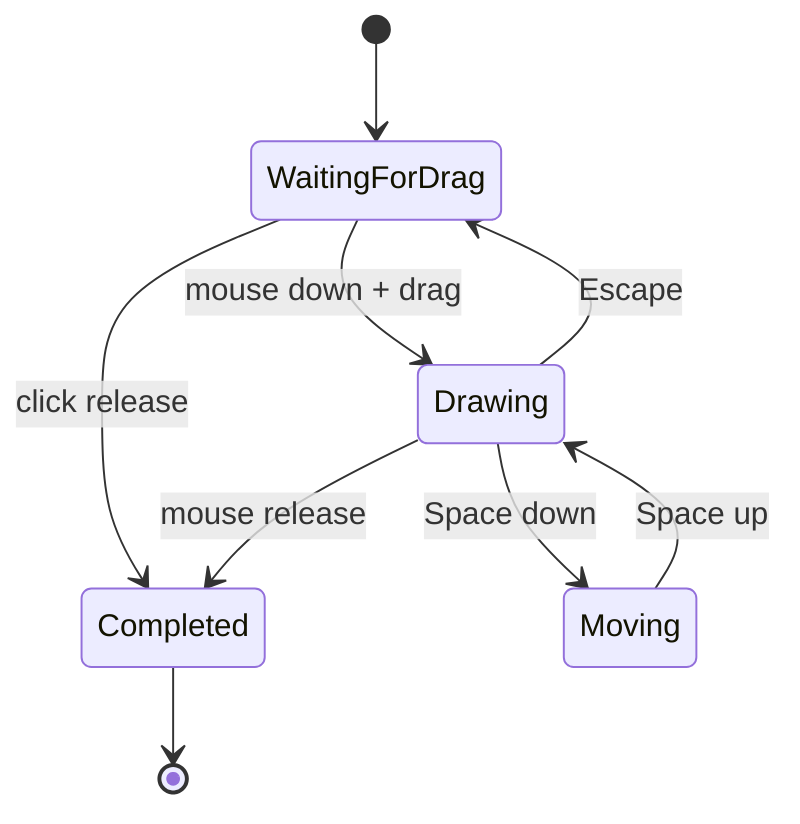

# feat: Add interactive screen-region capture

## Goal Capsule

- **Objective:** Replace activation-time full-display screen capture with a focused region-selection interaction that supports draw, reposition, restart, and click-to-finish gestures.
- **Authority:** The user's requested selection semantics are authoritative; preserve the existing screen-aware transcription lifecycle once a selection is completed.
- **Stop conditions:** No changes to recording hotkey recognition, OCR/refinement behavior beyond using the selected image, or unrelated rebrand work already present in the tree.

---

## Product Contract

### Summary

Screen-aware capture should first let the user select the relevant part of a display instead of automatically capturing the whole display beneath the cursor.

### Problem Frame

Full-screen capture can include irrelevant or sensitive context and makes it difficult to direct refinement at one UI element.

### Requirements

- R1. When screen-aware capture is activated, present an interactive selection surface on the display under the cursor before creating the screen context.
- R2. A primary-button drag draws the selected rectangle, and releasing the button completes a non-empty selection.
- R3. Holding Space during a drag moves the rectangle without changing its size; releasing Space resumes the active selection gesture.
- R4. Escape while the initial rectangle is being drawn discards it and returns to the initial-drag state so the user can try again.
- R5. A primary-button click without meaningful drag movement completes screen-aware capture using the full display rather than leaving selection mode active.
- R6. The capture pipeline crops, OCRs, encodes, and persists the selected region using the existing ScreenContext flow.
- R7. Cancelling the interaction must clean up all temporary windows and report a normal capture cancellation rather than leave a visible overlay.

### Scope Boundaries

- The interaction is limited to the display selected at activation time.
- Resizing an already-drawn rectangle, cross-display selection, and changing the screen-aware hotkey are deferred.

---

## Planning Contract

### Key Technical Decisions

- KTD1. Use a temporary AppKit borderless overlay window and view to own mouse and keyboard interactions, matching the project's existing overlay-window pattern while allowing it to become key and receive events.
- KTD2. Keep gesture state and coordinate math in a small, testable selection model; the overlay is responsible only for event delivery and visual feedback.
- KTD3. Capture only after a completed selection, using display-local backing-pixel coordinates to crop the display image before it reaches existing OCR and PNG encoding work.
- KTD4. Treat a click as an explicit full-display selection, so it completes deterministically without producing an empty crop.

### High-Level Technical Design

### Assumptions

- The current screen-recording permission check remains sufficient for both full-display image creation and cropping.
- A small click-sized capture fulfills the requested click termination behavior while avoiding undefined zero-size image capture APIs.

### Sequencing

Implement and validate geometry/state behavior first, then wire the overlay and crop result into ScreenCaptureClient, followed by release-note coverage.

---

## Implementation Units

### U1. Model region-selection gestures

- **Goal:** Define deterministic rectangle, move, reset, and click-completion behavior independently from AppKit event delivery.
- **Requirements:** R2, R3, R4, R5.
- **Dependencies:** None.
- **Files:** `Hex/Clients/ScreenCaptureSelection.swift`, `HexTests/ScreenCaptureSelectionTests.swift`.
- **Approach:** Store initial pointer, rectangle origin/size, and move anchor in display coordinates. Normalize drag geometry, preserve dimensions while moving, reset only the initial-drag state on Escape, and represent a no-drag release as an explicit full-display selection.
- **Patterns to follow:** Keep state local and use Foundation/CoreGraphics value types; place app-target tests in `HexTests/`.
- **Test scenarios:** Dragging from any diagonal yields a normalized rectangle; Space movement preserves width and height while shifting origin; Escape after drawing clears the rectangle and accepts a new drag; click/release yields a full-display selection; a regular release completes the drawn bounds.
- **Verification:** The gesture model covers the requested transitions without requiring an AppKit window.

### U2. Present and dismiss the selection overlay

- **Goal:** Show a focused display overlay with dimmed surroundings and outlined live selection, forwarding mouse, Space, and Escape events to the selection model.
- **Requirements:** R1, R2, R3, R4, R5, R7.
- **Dependencies:** U1.
- **Files:** `Hex/Clients/ScreenCaptureSelectionOverlay.swift`, `Hex/Clients/ScreenCaptureClient.swift`.
- **Approach:** Create an activation-time overlay on the display under the cursor, make it key for keyboard handling, and bridge completion/cancellation through a checked continuation. Ensure every terminal path orders the overlay out and releases event resources exactly once.
- **Patterns to follow:** Base screen targeting on `CaptureTarget.displayUnderCursor()` and follow `InvisibleWindow` conventions for a borderless, all-spaces overlay.
- **Test scenarios:** Manual smoke-check: activation displays an overlay on the correct display; the rectangle visibly follows draw and move gestures; Escape restarts drawing; a click and a drag each dismiss the overlay; cancellation leaves no overlay window.
- **Verification:** Interactive selection resolves exactly once with a completed region or CancellationError.

### U3. Crop selected pixels and preserve screen-context processing

- **Goal:** Produce ScreenContext from the chosen display region instead of the whole display.
- **Requirements:** R6, R7.
- **Dependencies:** U1, U2.
- **Files:** `Hex/Clients/ScreenCaptureClient.swift`, `HexTests/ScreenCaptureSelectionTests.swift`.
- **Approach:** Convert the completed AppKit rectangle to display-local backing pixels, clamp it to image bounds, crop the full display image, and pass the cropped result through the existing OCR, PNG encoding, logging, and ScreenContext construction path. Keep the existing capture callback timing after pixels are available.
- **Patterns to follow:** Reuse `ScreenCaptureProcessing` and its cancellation checks; use `HexLog.transcription` without logging screen content.
- **Test scenarios:** Coordinate conversion accounts for non-zero screen origins and backing scale; crop bounds clamp at display edges; a click preserves the full display image; an unavailable crop fails through the existing capture error path.
- **Verification:** Screen-aware refinement receives cropped PNG/OCR dimensions while no whole-display image is persisted as the screen context.

### U4. Record the user-visible change

- **Goal:** Add the required release-note fragment for the new selection interaction.
- **Requirements:** R1 through R6.
- **Dependencies:** U2, U3.
- **Files:** `.changeset/<generated-name>.md`.
- **Approach:** Use the repository's non-interactive changeset helper with a patch-level user-facing description.
- **Test expectation:** none -- changeset content is release metadata.
- **Verification:** A new changeset describes interactive region selection without processing it into the changelog.

---

## Verification Contract

- Build the Debug app with the project-prescribed unsigned `xcodebuild` command; do not run opt-in tests unless explicitly requested.
- Manually verify a full gesture pass on the locally built app: draw, Space-move, Escape-retry, click-finish, and screen-aware transcription using the selected region.
- Inspect the diff to ensure it does not alter unrelated existing worktree changes.

---

## Definition of Done

- The screen-aware activation starts an interactive display-local region selection rather than immediately processing a full display image.
- All requested selection gestures work and clean up the overlay on completion or cancellation.
- OCR, PNG encoding, and the existing transcription/refinement flow consume the selected crop.
- The Debug build succeeds and a patch changeset is present.
