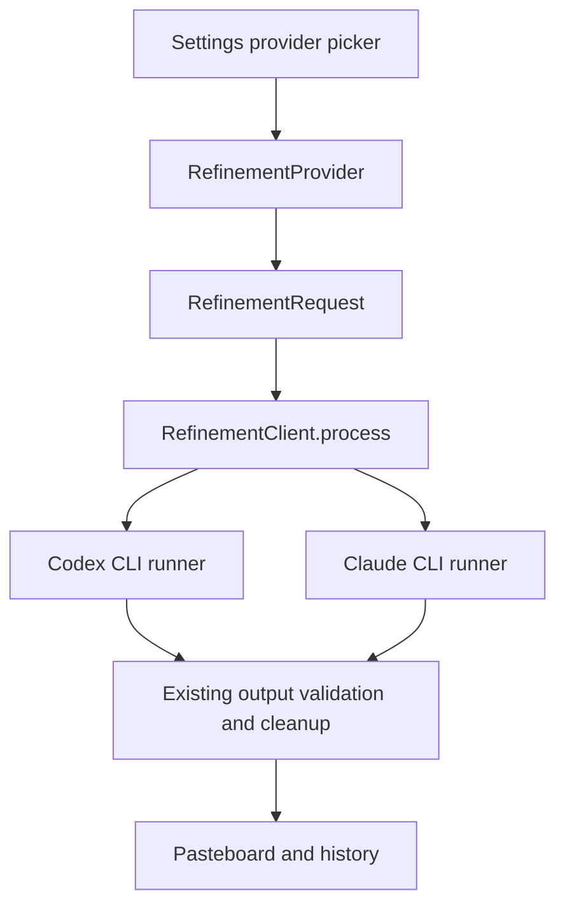

# CLI Refinement Providers - Plan

## Goal Capsule

- **Objective:** Let Octo use an already authenticated local Codex CLI or Claude Code CLI subscription to refine completed transcript text without an API key.
- **Authority:** The user request and existing Octo refinement behavior are authoritative; Nomen's CLI process adapters are the implementation reference for subscription routing and safe process handling.
- **Stop conditions:** Stop before adding interactive login, model selection, tool access, screen-image support, or a persistent agent/session system.
- **Execution profile:** Extend the existing refinement provider selection and client dispatch, preserving the existing raw-text fallback when refinement fails.

---

## Product Contract

### Summary

Octo will offer separate Codex CLI and Claude CLI providers alongside the existing direct OpenAI and Anthropic API providers.
When selected, each provider will invoke the locally installed, already authenticated official CLI with the completed refinement prompt and return only the generated text.

### Problem Frame

Users with a ChatGPT/Codex or Claude Code subscription currently have to supply and pay for separate API credentials to use refinement.
The local CLIs already authenticate those subscriptions, so Octo should route text-only refinement through them when the user selects the corresponding provider.

### Requirements

- R1. The provider picker exposes distinct `OpenAI / Codex CLI` and `Claude CLI` choices without changing the direct API provider choices.
- R2. Selecting a CLI provider requires no API key or model picker and clearly states that Octo uses the signed-in local CLI subscription.
- R3. A non-raw refinement request routed to Codex invokes the local `codex` CLI in a non-interactive text-generation mode and returns its final text.
- R4. A non-raw refinement request routed to Claude invokes the local `claude` CLI in non-interactive print mode and returns its final text.
- R5. CLI launches pass the completed prompt over standard input or an argument-safe mechanism, avoid shell interpolation, disable tools/session persistence where supported, collect standard error for diagnostics, and convert missing binaries, non-zero exits, and empty results into the existing refinement failure path.
- R6. Screen-aware refinement using an uploaded screenshot continues to select OpenRouter as its image provider when the selected CLI provider cannot accept image input; local-OCR requests remain text-only and can use a CLI provider.
- R7. Provider persistence remains backward compatible: old settings decode unchanged and the new providers round-trip through `HexSettings`.
- R8. The user-facing feature includes a patch changeset fragment.

### Acceptance Examples

- AE1. Given the user selects Codex CLI and has completed `codex` authentication, a normal refined transcript is passed to `codex` and its text replaces the raw transcript.
- AE2. Given the user selects Claude CLI and has completed `claude` authentication, a normal refined transcript is passed to `claude` and its text replaces the raw transcript.
- AE3. Given either CLI is unavailable, signed out, exits non-zero, or emits no usable text, Octo preserves its existing refinement-error handling instead of pasting CLI diagnostics.
- AE4. Given a CLI provider and uploaded screen-aware input, Octo continues using the existing OpenRouter image fallback.

### Scope Boundaries

- The feature only uses subscription state already established in the official CLIs; it does not sign users in, change global CLI settings, or store credentials.
- The feature is text-only. CLI-provided image analysis, agents, tools, MCP, and persistent conversations are outside scope.
- Direct OpenAI and Anthropic API-key providers remain available and unchanged.

---

## Planning Contract

### Key Technical Decisions

- KTD-1. Add distinct enum cases for `codexCLI` and `claudeCLI` rather than repurposing `.openAI` or `.anthropic`, preserving a clear difference between API billing and subscription-backed CLI routing.
- KTD-2. Use `Process` with an explicit executable URL and argument array, not a shell command, so transcript and instruction text cannot be interpreted by a shell.
- KTD-3. For Codex, use `codex exec` in a temporary directory with non-interactive, sandboxed/no-tool options and parse the final text output; for Claude, follow Nomen's text-generation posture with `claude -p`, stdin prompt transport, `--bare`, disabled tools, no session persistence, and JSON result output for reliable extraction.
- KTD-4. Keep CLI invocation in a focused helper under `Hex/Clients`, injectable at the process-running boundary so unit tests can assert commands and failure mapping without invoking a real subscribed CLI.
- KTD-5. Treat both CLI providers as text-only by relying on `RefinementProvider.supportsImageInput == false`, which retains the existing OpenRouter fallback for screenshot uploads.

### High-Level Technical Design

### Sources

- `Hex/Clients/RefinementClient.swift` owns prompt construction, provider dispatch, output validation, and the established error path.
- `HexCore/Sources/HexCore/Models/RefinementProvider.swift` and `HexCore/Sources/HexCore/Settings/HexSettings.swift` define provider persistence and screen-aware provider selection.
- `Hex/Features/Settings/RefinementSectionView.swift` renders the picker and provider-specific configuration.
- Nomen's `src/main/ai/claude-cli-runtime.ts` uses `claude -p` with stdin, `--bare`, no session persistence, disabled tools, and structured output handling.
- Nomen's `src/main/ai/codex-app-server.ts` is the reference for routing subscribed Codex sessions through the official local CLI, but Octo should use the simpler one-shot `codex exec` interface because refinement is stateless text transformation.

### Sequencing

Implement the provider model and process runner first, then connect the existing client and settings UI, then add focused tests and a changeset.

---

## Implementation Units

### U1. Model and process abstraction for CLI refinement

- **Goal:** Represent the two subscription providers and provide a cancellation-safe, testable one-shot process runner that yields cleaned text or an existing refinement error.
- **Requirements:** R3, R4, R5, R6, R7.
- **Files:** Modify `HexCore/Sources/HexCore/Models/RefinementProvider.swift`, `Hex/Clients/RefinementClient.swift`; create `Hex/Clients/CLIRefinementClient.swift` or a narrowly scoped adjacent helper; modify `HexCore/Tests/HexCoreTests/RefinementTests.swift` and/or add the appropriate test target file.
- **Patterns:** Follow the `RefinementClient.safeRefine`, `validated`, and `RefinementError` patterns. Use `HexLog.transcription` with private privacy annotations for prompts, output, executable paths, and standard error.
- **Approach:** Add `codexCLI` and `claudeCLI` cases, keep both image-ineligible, map each case in `RefinementClient.process`, and delegate to a process runner that launches the CLI via `Process` with no shell. Feed the complete prompt to stdin, terminate the child on task cancellation, collect bounded stderr, and expose deterministic command construction/output extraction for tests. Use a temporary working directory to avoid a repository context and do not permit tools or persistent sessions.
- **Test Scenarios:** Verify provider Codable round trips; verify both providers are image-ineligible; assert Codex and Claude command construction carries the expected non-interactive options; verify stdout/structured JSON result extraction; verify missing executable, non-zero exit, empty output, malformed structured output, and cancellation map to the refinement failure path without exposing prompt text.
- **Verification:** The new tests compile in the relevant Xcode test target; the Debug build compiles all modified production code.

### U2. Route CLI providers through refinement and expose configuration

- **Goal:** Make the new providers selectable and understandable in Settings without requesting an API key or model.
- **Requirements:** R1, R2, R6.
- **Files:** Modify `Hex/Features/Settings/RefinementSectionView.swift`; modify `Hex/Clients/RefinementClient.swift` only as required to connect U1.
- **Patterns:** Mirror the existing provider `Picker` tags and provider-specific explanatory `VStack` blocks. Keep wording aligned with the app's existing privacy explanations.
- **Approach:** Add separate Codex CLI and Claude CLI labels to the picker. Render a concise help block for each that says it uses the corresponding signed-in local CLI subscription, only sends the completed text prompt, never sends audio, and falls back to unchanged output if the CLI is unavailable or not signed in. Do not show API-key fields or a model selector. Ensure existing screen-aware UI continues to show its normal image-provider guidance for these text-only providers.
- **Test Scenarios:** Confirm provider selection persists and no existing direct-provider key state is affected; manually inspect the Debug Settings provider menu and each CLI help state.
- **Verification:** Debug build succeeds and Settings renders all provider options without a missing-case crash.

### U3. Release note and focused regression coverage

- **Goal:** Lock in subscription routing behavior and document the user-visible addition.
- **Requirements:** R5, R7, R8.
- **Files:** Modify `HexCore/Tests/HexCoreTests/RefinementTests.swift` and/or the test file introduced by U1; create `.changeset/<generated-name>.md`.
- **Patterns:** Follow existing `XCTest` assertions in `HexCore/Tests/HexCoreTests/RefinementTests.swift` and the repository's `bun run changeset:add-ai patch` workflow.
- **Approach:** Add the focused regression cases from U1 in the most appropriate target, ensuring no real external binary or subscription is required. Add a patch changeset that explains users can choose signed-in Codex or Claude CLIs for refinement.
- **Test Scenarios:** Decode settings payloads that omit or contain a CLI provider; command/result tests cover stdout and structured result parsing; process errors never become user-facing refinement output.
- **Verification:** The affected test target builds; the Debug app build succeeds; the changeset is present and names the user impact.

---

## Verification Contract

| Units | Validation | Done signal |
|---|---|---|
| U1, U3 | Inspect and build the existing `HexCore` XCTest target coverage for provider persistence and CLI command/result extraction. | Tests do not invoke actual `codex` or `claude` binaries and cover success plus failure paths. |
| U1-U3 | `xcodebuild -scheme Octo -configuration Debug -skipMacroValidation -skipPackagePluginValidation CODE_SIGNING_ALLOWED=NO build` | The unsigned Debug app builds successfully. |
| U2 | Launch the Debug app and inspect Settings → Transcription Refinement. | Both CLI providers are selectable, show no key/model controls, and retain the screen-aware fallback behavior. |

## Definition of Done

- U1 is complete when both official CLIs are represented by distinct providers, run without shell interpolation or tool access, and map all unusable output to existing refinement failure behavior.
- U2 is complete when users can select either subscription provider and understand its authentication, privacy, and fallback behavior without API-key configuration.
- U3 is complete when regression coverage does not need a real CLI subscription and a patch changeset documents the feature.
- Existing direct API providers, prompt cleanup, selected-text refinement, and screen-aware OpenRouter image fallback retain their behavior.
- The final diff contains no temporary CLI credentials, transcript content, global CLI configuration writes, or abandoned process-launch experiments.
