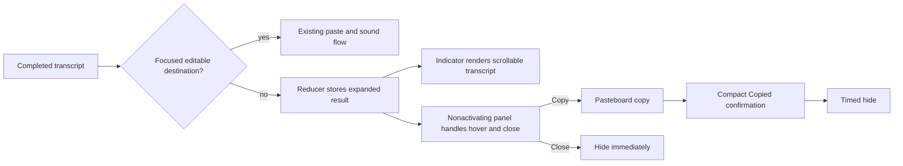

## Goal Capsule

**Objective:** Preserve a completed transcript visibly and make it copyable when Octo detects no focused editable destination, instead of attempting a blind paste.

**Authority:** The user's requested fallback interaction is authoritative. Existing TCA, dependency-client, privacy, logging, unsigned Debug-build, and changeset conventions in `AGENTS.md` govern implementation details.

**Stop conditions:** Stop and surface a blocker if a reliable Accessibility-backed editable-destination check cannot distinguish an absent target without changing normal paste behavior, or if the interactive panel cannot remain nonactivating.

**Execution profile:** Modify the completion, presentation, and interaction seams only. Keep transcript contents private in logs and preserve the dirty recording-race worktree changes.

**Tail ownership:** The executor owns the implementation, the user-facing patch changeset, the Debug build, and focused manual interaction verification. Tests are not run unless the user explicitly requests them.

## Product Contract

### Summary

When no text field can receive a completed transcript, Octo retains the result in an expanded indicator rather than losing it to an ineffective paste.

### Problem Frame

The transcription completion path always pastes through a `Void` client, even when there is no focused editable control.

The current compact, click-through indicator has no surface for reading, copying, or dismissing a result in that case.

### Requirements

- R1. Before the ordinary completion paste, determine whether a focused editable destination is available at completion time.
- R2. When no destination is available, show the completed transcript in an indicator approximately three times the usual width and five times the usual height, at the configured indicator location and clamped to the active display; the default/current bottom pill expands upward.
- R3. Keep all transcript text readable and vertically scrollable when it exceeds the available result area.
- R4. Hovering the expanded result shows a glassy/blurred overlay labeled "Copy to Clipboard" while retaining a prominent top-right close control.
- R5. Copy writes the exact completed transcript to the existing pasteboard client, collapses to a compact "Copied" confirmation, and hides after about two seconds.
- R6. Closing the expanded result hides it immediately without writing to the clipboard.
- R7. A normal editable destination continues through the existing paste path without showing this fallback.
- R8. A newer recording or completion supersedes an open result and cancels any prior dismissal timer.

### Acceptance Examples

- AE1. With Finder or the desktop active and no editable control focused, completing "Hello there" opens the expanded result and displays the complete text instead of trying to paste it.
- AE2. A long result can be scrolled to reveal its final line; leaving hover restores readable text, and hovering displays "Copy to Clipboard" above a glassy blur.
- AE3. Copying a fallback result places its complete, unmodified text on the clipboard, displays "Copied" in a compact pill, then hides after roughly two seconds.
- AE4. Selecting the X immediately removes the fallback and leaves the clipboard unchanged.
- AE5. With an editable text destination focused, a completed transcript follows the existing paste and sound behavior and never expands the result pill.

### Scope Boundaries

**In scope:** Focused editable-target detection, transient completion presentation state, expanded result UI, an interactive nonactivating hover/copy/close panel, targeted reducer coverage, manual UI verification, and a patch changeset.

**Out of scope:** Changing the user's chosen indicator location, diagnosing a paste rejected after an editable target is found, a persistent transcript viewer, new settings, or direct AppKit clipboard writes from views.

## Planning Contract

### Key Technical Decisions

- KTD1. Add an explicit, injectable editable-destination result to `PasteboardClient` and query it at completion time. Its `available`, `absent`, and `indeterminate` cases distinguish a verified lack of editable focus from inaccessible or unsupported Accessibility data. Do not infer no focus from a simulated Cmd-V result, because that path cannot reliably distinguish a rejected paste from no target.
- KTD2. Keep fallback text and phase in `TranscriptionFeature.State`, with actions for showing, copying, closing, and timed dismissal. This makes latest-result wins and cancellation testable through TCA.
- KTD3. Preserve the existing paste API and completion behavior after an editable target is found or target inspection is indeterminate. The fallback is only for verified target absence, not an Accessibility or automation failure after the normal path begins.
- KTD4. Render transcript content in the existing indicator window, but render hover controls in the already-aligned `PillInteractionPanel`. The separate panel stays nonactivating and receives mouse events without turning the full-screen overlay into a click target.
- KTD5. Derive expanded dimensions from the configured indicator metrics, then clamp the frame to the visible display. This follows the request's proportional sizing while keeping text, Copy, and X reachable on small displays.

### High-Level Technical Design

### Assumptions

- The requested bottom-pill behavior respects the user's configured indicator placement rather than forcibly moving a top or side indicator.
- "No focus" means the Accessibility system verifies that no editable destination is focused; unavailable or inconclusive Accessibility data follows the existing paste path, and a later paste rejection remains part of that behavior.
- The default/current bottom location expands upward. Other user-selected locations retain their configured anchor instead of being moved to the bottom.
- Two seconds is the desired compact "Copied" confirmation duration.

### Risks and Mitigations

- Accessibility role/value checks differ between editors. Keep the predicate conservative and use it only to identify the no-target branch; do not replace the established paste mechanism.
- The interaction panel currently opens History on every tap. Make its content mode-aware so expanded-result clicks cannot trigger History.
- The worktree contains unrelated recording changes, including `TranscriptionFeature.swift`. Integrate only against the current state and leave those changes intact.

### Sources and Research

- `Hex/Features/Transcription/TranscriptionIndicatorView.swift` owns status-based metrics, animations, and pill-frame reporting.
- `Hex/Views/InvisibleWindow.swift` and `Hex/App/HexAppDelegate.swift` provide the nonactivating, frame-aligned interaction panel.
- `Hex/Clients/PasteboardClient.swift` already centralizes pasteboard access and editable Accessibility checks.
- `Hex/Features/History/HistoryFeature.swift` provides the established reducer-to-`pasteboard.copy` pattern.

## Implementation Units

### U1. Report focused editable-target availability

**Goal:** Make completion code able to choose the no-target fallback before beginning the normal paste path.

**Requirements:** R1, R7, AE1, AE5.

**Dependencies:** None.

**Files:** `Hex/Clients/PasteboardClient.swift`, `Hex/Features/Transcription/TranscriptionFeature.swift`, `HexTests/TranscriptionResultPresentationTests.swift`.

**Approach:** Extend `PasteboardClient` with an async, injectable focused-editable-destination result backed by the existing Accessibility-focused-element inspection. At transcription/refinement completion, route `absent` to the fallback while `available` and `indeterminate` retain persistence plus the normal paste/sound route. Keep transcript text out of new diagnostics.

**Patterns to follow:** Existing `PasteboardClient` Accessibility checks and injected TCA dependencies; completion ownership guards in `TranscriptionFeature`.

**Test scenarios:**

- Covers AE5. An editable destination reports available and a completed transcript invokes the existing paste path without result presentation.
- Covers AE1. An unavailable destination preserves the completed text in fallback presentation and does not invoke paste.
- Inconclusive Accessibility inspection preserves the existing paste path and does not show a fallback.
- A stale completion from a superseded recording cannot create a fallback result.

**Verification:** Reducer state and pasteboard probes distinguish normal insertion from known target absence.

### U2. Model the transient result presentation lifecycle

**Goal:** Hold fallback text, copy confirmation, and deterministic dismissal in reducer state.

**Requirements:** R5, R6, R8, AE3, AE4.

**Dependencies:** U1.

**Files:** `Hex/Features/Transcription/TranscriptionFeature.swift`, `HexTests/TranscriptionResultPresentationTests.swift`.

**Approach:** Add a small explicit presentation phase containing the fallback text or compact copied confirmation. Add copy, close, dismissal, and new-recording transitions, with a dedicated cancellation ID and injected clock for the roughly two-second confirmation delay. Copy calls `pasteboard.copy` with the retained exact text; close and replacement clear state without copying.

**Patterns to follow:** The feature's existing error-dismissal cancellation and `HistoryFeature` direct-copy effect.

**Test scenarios:**

- Covers AE3. Copy receives the full original text, transitions to the copied phase, and clears after the injected delay.
- Covers AE4. Close clears presentation immediately and the pasteboard copy probe remains untouched.
- Starting a recording and receiving a newer result each cancel an older pending dismissal so it cannot reappear or hide the newer state.

**Verification:** The state machine has no retained result after close, timeout, or replacement, and only the copy action mutates the clipboard.

### U3. Render expanded transcript and interactive controls

**Goal:** Turn fallback state into an accessible, scrollable expanded indicator with a hover copy overlay and close affordance.

**Requirements:** R2, R3, R4, R5, R6, AE1, AE2, AE3, AE4.

**Dependencies:** U2.

**Files:** `Hex/Features/Transcription/TranscriptionIndicatorView.swift`, `Hex/Views/InvisibleWindow.swift`, `Hex/App/HexAppDelegate.swift`.

**Approach:** Add presentation-aware status/content and proportional expanded metrics to the indicator, using a vertical scroll container for text and the existing geometry preference for the larger frame. Pass the transcription store into the mode-aware panel so, only while expanded, it provides a material/blurred hover overlay with a semantic Copy button plus a persistent, large top-right X button. Give both controls explicit accessibility labels and hints, preserve their reading order (Copy, then Close), and verify VoiceOver activation while the panel remains nonactivating. Preserve the ordinary History tap outside result mode. Clamp the expanded frame within the current screen, expanding upward where needed for the bottom placement and retaining another configured anchor elsewhere.

**Patterns to follow:** Existing `.snappy` status animation and `IndicatorFramePreferenceKey`; `.thinMaterial` styling in `AutoDownloadBannerView`; plain icon-button/help conventions in `HistoryFeature`.

**Test scenarios:**

- Covers AE2. A long result receives a bounded vertical scroll region rather than growing beyond its expanded frame.
- The expanded, copied, and hidden phases compute the expected relative size and publish the matching interaction frame.
- Covers AE3 / AE4. Copy and close controls dispatch distinct reducer actions and the old History action is unavailable during expanded-result mode.
- Copy and Close expose accessible labels, hints, and the intended VoiceOver reading order without activating Octo.

**Verification:** Manual Debug-build QA confirms a no-focus completion expands the configured indicator safely, hover visually obscures the text with Copy, X remains reachable, and the panel never activates Octo or steals focus from the prior app.

### U4. Record the user-facing change

**Goal:** Include the fallback behavior in the release pipeline.

**Requirements:** R1-R8.

**Dependencies:** U1, U2, U3.

**Files:** `.changeset/<generated>.md`.

**Approach:** Create a patch changeset with the project's non-interactive script after implementation. Do not touch the pre-existing untracked changeset.

**Test expectation:** none -- release-note metadata has no executable behavior.

**Verification:** The new generated fragment describes the no-focus transcript copy fallback and is the only changeset added for this work.

## Verification Contract

- Build the unsigned Debug app with `xcodebuild -scheme Octo -configuration Debug -skipMacroValidation -skipPackagePluginValidation CODE_SIGNING_ALLOWED=NO build`.
- Do not run XCTest or release commands unless the user explicitly requests them. Add the focused reducer coverage specified in U1/U2, and report that test execution was deliberately skipped under the repository policy.
- Manually verify normal focused-text insertion, unavailable and indeterminate target inspection, no-focus expansion, long-text scrolling, hover Copy, copied confirmation/timing, close-without-copy, VoiceOver labels/actions, and a newer transcription replacing an old fallback.
- If Xcode stalls after `CreateBuildDescription`, use only the documented stuck-SDK-probe recovery before allowing the Debug build to continue.

## Definition of Done

- R1-R8 and AE1-AE5 are satisfied without changing normal paste behavior for an editable target.
- The interaction panel stays nonactivating and mode-aware, and no transcript text is added to logs.
- The expanded result remains within the active display and supports scrolling and accessible Copy/Close controls.
- Targeted reducer tests are added, the unsigned Debug build passes, and manual interaction evidence is recorded.
- A new patch changeset is present, existing dirty worktree changes remain intact, and abandoned implementation code is removed from the final diff.
