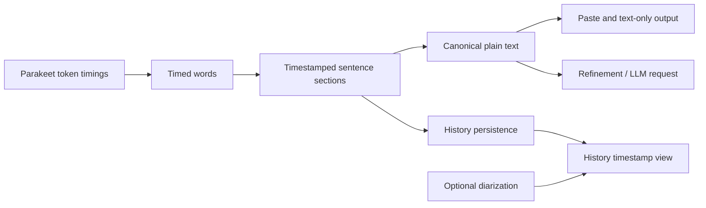

# feat: Capture and present timestamped transcript sections

## Goal Capsule

- **Objective:** Make timestamped sentence sections the canonical local transcription representation for providers that expose word timings, then use their plain-text projection for History, paste, and LLM refinement.
- **Authority:** Follow the user request and `AGENTS.md`; preserve concurrent speaker-identification work and compatibility with existing History data.
- **Execution profile:** Shared HexCore model and tests, Parakeet capture, TCA persistence/refinement plumbing, History rendering, and a Changesets fragment.
- **Stop conditions:** Do not add a second ASR inference pass to obtain timestamps, change external LLM prompts to include timestamp metadata, or require speaker identification for timestamped History rendering.

## Product Contract

### Summary

Parakeet transcripts should retain their ASR timing information as sentence-sized sections regardless of whether speaker identification is enabled.

### Problem Frame

FluidAudio already returns Parakeet token timings, but the app currently keeps them only long enough to support optional speaker diarization.

As a result, ordinary History records and text-only/refinement paths have no durable timed structure, and the timestamp UI falls back unless diarization also succeeds.

### Requirements

- R1. When an ASR provider returns timed words, Octo deterministically joins them into ordered, timestamped sentence sections without invoking another ASR model or diarization.
- R2. The sentence sections are the canonical text source for a new transcription's raw text, text-only output, paste path, and refinement/LLM request input.
- R3. Each newly completed History transcript persists its timestamped sections independently of optional speaker-attributed segments.
- R4. The History timestamp presentation renders the persisted sentence sections for every new timed transcript, adding speaker names only when speaker attribution is available.
- R5. Existing History records and ASR providers without timings remain readable, replayable, searchable, and refinable using their stored plain-text fallback.
- R6. Sentence construction retains word order, derives its span from its first and last timed words, preserves natural spacing around punctuation, and creates a final section for unterminated speech.
- R7. Speaker identification remains an opt-in enrichment pass; its failure must never discard timestamps or otherwise change a successful local transcript.

### Scope Boundaries

**In scope:** Parakeet's existing FluidAudio token timings, provider-neutral timed sentence sections, History persistence and rendering, canonical plain-text projection, refinement input, compatibility tests, and release-note coverage.

**Out of scope:** Timestamp generation for ASR providers that do not expose timings, changing LLM prompts to reveal offsets, retroactively repairing existing stored transcripts, or changing diarization model behavior.

## Planning Contract

### Key Technical Decisions

- Define the timestamped sentence-section model alongside `TimedTranscriptWord` in HexCore so every provider and feature uses the same representation.
- Build sections as a pure deterministic transformation from timed words, splitting at terminal sentence punctuation and returning the residual words as one final section.
- Have `TranscriptionOutput` expose the section-derived canonical plain text, falling back to its provider text only when no timed sections exist.
- Persist sections as an optional `Transcript` field; Codable's absent-key behavior keeps older History JSON compatible.
- Treat `speakerSegments` as a presentation enrichment. The timestamp UI uses generic sections first and adds a speaker name only when exactly one attributed turn contains the whole section; sections spanning speaker turns remain honestly unlabeled.
- Keep speaker labels out of the canonical text projection: they are a History-only overlay and must never leak into paste or LLM/refinement input.
- Preserve the per-card History presentation preference and existing raw/result distinction; only the underlying raw-text source changes.

### Assumptions

- FluidAudio 0.15.5's normal TDT transcription continues to return `tokenTimings` as part of `ASRResult`; extracting and grouping them is negligible compared with ASR inference.
- A sentence boundary is recognized from terminal sentence punctuation in the normalized timed-word stream; model punctuation is the available local authority.
- The repository policy permits adding targeted tests, but does not authorize running tests unless explicitly requested. The required Debug build remains the runtime verification gate.

### High-Level Technical Design

## Implementation Units

### U1. Define canonical timestamped sentence sections

- **Goal:** Add a provider-neutral, Codable section type and pure timed-word stitching so a timing-capable ASR result contains both sections and its canonical text projection.
- **Requirements:** R1, R2, R6.
- **Dependencies:** None.
- **Files:** `HexCore/Sources/HexCore/Models/SpeakerIdentification.swift`; `HexCore/Tests/HexCoreTests/SpeakerIdentificationTests.swift` or a focused new HexCore timing test file.
- **Approach:** Keep the existing timed-word model. Add sentence-section construction and rendered-text behavior that preserves ordering, punctuation spacing, first/last word spans, empty-token handling, and an unterminated final sentence. Update `TranscriptionOutput` so callers receive the section-derived text whenever timed words produce sections, while timing-free providers retain their supplied text.
- **Patterns to follow:** `SpeakerIdentification.renderedText(from:)`, `SpeakerAttributedSegment`, and the existing `TranscriptionOutput` initializer.
- **Test scenarios:** Timed words ending in multiple sentences produce ordered sections with correct spans; punctuation attaches naturally to the preceding word; unpunctuated words still produce one section; empty or timing-free word arrays leave supplied text unchanged; canonical text is the section projection.
- **Verification:** The shared model is Codable/Equatable/Sendable and all existing speaker-attribution call sites still receive their original ordered words.

### U2. Persist and propagate canonical sections

- **Goal:** Capture Parakeet timings as sections, retain them on every new History record, and use the canonical text projection through normal, replay, and refinement flows.
- **Requirements:** R2, R3, R5, R7.
- **Dependencies:** U1.
- **Files:** `Hex/Clients/ParakeetClient.swift`; `Hex/Features/Transcription/TranscriptionFeature.swift`; `Hex/Features/History/HistoryFeature.swift`; `HexCore/Sources/HexCore/Models/TranscriptionHistory.swift`; `HexCore/Sources/HexCore/TranscriptPersistenceClient/TranscriptPersistenceClient.swift`; `HexCore/Tests/HexCoreTests/TranscriptionHistoryTests.swift`; `HexCore/Tests/HexCoreTests/RefinementTests.swift`.
- **Approach:** Convert FluidAudio token timings to timed words at the existing Parakeet seam, let the shared model create canonical sections before any punctuation-removal or remapping transform, and save those sections alongside `rawText` and optional speaker segments when the durable checkpoint is updated. Apply the existing text transforms to each section, then rebuild the canonical plain-text projection. Ensure replay refreshes both canonical text and sections. Send that label-free projection to all paste/refinement paths, without exposing timestamps or speaker names to LLM prompts. Leave legacy records and providers with no timings on their current text fallback.
- **Patterns to follow:** The current durable recording checkpoint lifecycle, optional `speakerSegments` persistence, `rawText` fallback logic, and `RefinementRequest` construction.
- **Test scenarios:** A new timed transcript writes sections and its matching canonical raw text; per-section remapping updates the plain projection without losing spans; an old encoded transcript missing the field decodes successfully; a timing-free output retains its provider text; replay replaces stale sections; refinement and paste receive canonical text with neither timestamp syntax nor speaker prefixes; diarization failure leaves timed sections intact.
- **Verification:** New output flows have one canonical text projection, and persisted optional sections never make older stored History unreadable.

### U3. Render timed sections independently of speaker labels

- **Goal:** Make the History detailed presentation consistently show timestamps for persisted sentence sections, with speaker names layered on only when available.
- **Requirements:** R4, R5, R7.
- **Dependencies:** U2.
- **Files:** `Hex/Features/History/HistoryFeature.swift`.
- **Approach:** Retain the existing per-card text-only/detailed preference, elapsed-time formatting, highlighting, accessibility controls, and raw/result presentation. In detailed mode, render stored timestamped sections in order even if speaker identification is disabled. Add a speaker label only when one attributed turn contains the whole section; a section that spans two turns remains visible but unlabeled, rather than implying either speaker. Preserve the explicit legacy fallback when no sections were captured.
- **Patterns to follow:** `RunHistoryItemView`, `highlightedText(_:matching:)`, the existing `format(_:)` helper, and current `speakerSegments` rendering.
- **Test scenarios:** Timed sections render in order without speakers; a speaker-attributed turn that contains a section adds its name; a sentence spanning two speaker turns remains visible and unlabeled; a legacy item falls back to text and an explanatory message; controls retain their accessible labels and text-only presentation keeps the canonical raw text.
- **Verification:** The History view preserves playback, copy, rerun, search, delete, and generated-result behavior while no longer treating diarization as a prerequisite for timestamps.

### U4. Add release-note coverage

- **Goal:** Describe the user-visible availability of timestamped transcript sections.
- **Requirements:** R3, R4.
- **Dependencies:** U1, U2, U3.
- **Files:** `.changeset/*.md`.
- **Approach:** Add a patch changeset through the repository's non-interactive Changesets script.
- **Test expectation:** none -- release metadata only.
- **Verification:** The fragment accurately describes timestamps without overstating speaker identification support.

## Verification Contract

- Review the new unit tests for model stitching, persistence compatibility, canonical refinement input, and History fallback behavior; do not run tests unless the user explicitly requests them.
- Build the unsigned Debug app with the repository-prescribed `xcodebuild` command, applying the documented stuck-SDK-probe mitigation only if the build service hangs before compilation.
- Manually verify a new Parakeet recording with speaker identification disabled: text-only output is normal prose, the detailed History view shows timestamped sentences, and any refinement receives the same canonical prose.
- Manually verify a legacy/timing-free History entry and a diarization failure still show the current safe fallback.

## Definition of Done

- Timing-capable output produces durable timestamped sentence sections and canonical plain text without a second ASR pass.
- New History entries display those sections even without speaker identification.
- Paste, text-only display, replay, and LLM refinement share the same canonical plain-text projection.
- Old history and timing-free providers remain backward compatible.
- Targeted tests are added, the required Debug build passes, and a patch Changesets fragment is present.

## Sources and Research

- `Hex/Clients/ParakeetClient.swift` already maps FluidAudio `tokenTimings` into `TimedTranscriptWord` values.
- FluidAudio 0.15.5 constructs `tokenTimings` inside normal TDT transcription before returning `ASRResult`.
- `docs/plans/2026-07-23-cli-refinement-providers-plan.md` confirms refinement should consume canonical completed text without coupling prompts to local presentation metadata.
