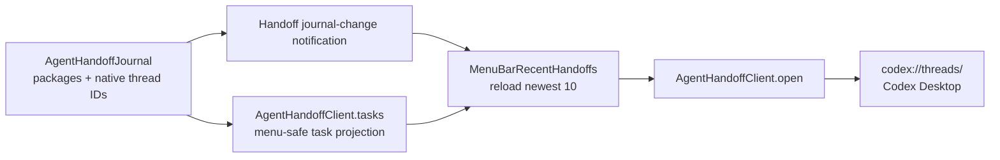

# feat: Add menu-bar recent handoffs

## Goal Capsule

- **Objective:** Let a user open a recent Codex handoff directly from Octo's menu-bar menu, so checking its progress no longer requires first locating it in Codex.
- **Authority:** The existing Agent Handoff journal remains Octo's durable source of recent tasks; Codex remains the authority for task execution and display.
- **Stop conditions:** Do not create, resume, or mutate Codex tasks from this menu. Do not expose prompt content or add remote task-status polling.
- **Execution profile:** Native macOS/SwiftUI and TCA dependency work. Preserve unrelated in-progress workspace changes.

---

## Product Contract

### Summary

The bottom of Octo's menu-bar menu will contain a Recent Handoffs section. It shows the ten most recently created handoff tasks that can be opened in their native provider, and selecting a Codex item deep-links directly to that task in Codex Desktop.

### Problem Frame

Handoffs are created as visible Codex threads, but the existing opener merely activates the app. Users must manually find the correct task each time they want to check its progress.

### Requirements

- **R1.** Show a `Recent Handoffs` section at the bottom of the menu-bar menu when durable handoff records exist.
- **R2.** Limit the section to the ten newest records, ordered newest first, using the existing handoff journal as the source of truth.
- **R3.** Each row uses the existing short task title, clearly identifies its provider, and opens only when its durable native task handle is available.
- **R4.** Selecting a Codex row opens that exact thread in the installed Codex Desktop app through its registered `codex://threads/<thread-id>` URL scheme.
- **R5.** The section refreshes when the menu appears and when Octo creates or updates a handoff record, without requiring an Octo restart.
- **R6.** If journal loading or deep-link construction fails, omit unusable rows and retain the rest of the menu as normal.

### Acceptance Examples

- **AE1.** Given twelve completed or current Codex handoffs, when the user opens the Octo menu, then it shows the newest ten tasks and no older two.
- **AE2.** Given a journaled Codex task with thread ID `abc`, when its menu row is selected, then Octo requests `codex://threads/abc` and Codex Desktop navigates to that task.
- **AE3.** Given a new handoff is launched while Octo is running, when its journal record is created, then the next visible menu presentation includes it without restarting Octo.

### Scope Boundaries

#### Deferred to Follow-Up Work

- Querying Codex for live remote task status, task archives, filtering, or search.
- Opening legacy records that have no persisted native thread handle.

#### Outside this feature

- Changing the handoff planning, task creation, or normal Codex execution protocol.

---

## Planning Contract

### Key Technical Decisions

1. **Project a safe menu model from the journal.** Extend `AgentHandoffTask` with its optional native thread destination and lifecycle state, rather than exposing the private stored-package representation to SwiftUI. Existing legacy tasks remain readable but are not made actionable without a native handle.
2. **Use the registered Codex URL scheme for exact navigation.** Build the validated `codex://threads/<thread-id>` URL and open it with `NSWorkspace`, replacing the current Codex branch that only activates `/Applications/ChatGPT.app`. The installed desktop bundle's routing schema confirms `codex:` URLs with host `threads` and a UUID conversation path.
3. **Refresh locally, not by polling Codex.** Post a narrow journal-change notification after successful writes and have the menu view reload on receipt and appearance. This gives immediate local consistency while keeping Codex's own UI and state model authoritative.

### High-Level Technical Design

### Assumptions

- The installed Codex Desktop app continues to register the `codex` URL scheme, as confirmed from this machine's app bundle.
- Handoff titles are already concise enough for a menu row; SwiftUI/AppKit will truncate unusually long titles using standard menu behavior.

### Risks & Dependencies

- The deep-link path is an integration contract owned by Codex Desktop. Isolate URL creation in a testable helper so it can be updated without changing the menu surface if that contract changes.
- Journal notification delivery may occur off the main actor. The menu view must switch its state update to the main actor.

### Sequencing

Implement the durable task projection and exact opener first, then build the menu view against that dependency and add it as the final section in `MenuBarExtra`.

---

## Implementation Units

### U1. Expose openable recent task destinations

- **Goal:** Project each durable handoff package into a safe UI model carrying its provider-native destination and state.
- **Requirements:** R2, R3, R6.
- **Dependencies:** None.
- **Files:** `Hex/Clients/AgentHandoffClient.swift`; `HexTests/AgentHandoffClientTests.swift` (new or existing focused test file).
- **Approach:** Preserve existing ordering and legacy compatibility, attach a Codex/Claude thread only when a valid persisted handle exists, and add a journal-change notification on successful append/state writes. Keep handoff prompt text out of the new menu-facing fields.
- **Test scenarios:** A journal with more than ten records is projected newest first; a package with a Codex thread is openable; a legacy/missing-handle package remains non-openable; state and title are retained; a failed write emits no refresh notification.
- **Verification:** Focused tests prove journal projection and write-notification behavior without touching task creation protocols.

### U2. Navigate Codex threads by deep link

- **Goal:** Make the existing `open` dependency select the exact Codex task rather than merely foregrounding the app.
- **Requirements:** R4, R6; Covers AE2.
- **Dependencies:** U1.
- **Files:** `Hex/Clients/AgentHandoffClient.swift`; `HexTests/AgentHandoffClientTests.swift`.
- **Approach:** Isolate valid Codex URL construction and have the opener use it through `NSWorkspace`. Leave the Claude resume behavior unchanged and do nothing for malformed or unavailable handles.
- **Test scenarios:** A normal UUID-like thread ID produces the expected `codex` URL; reserved characters are safely encoded; an empty identifier produces no URL; Claude still routes through its existing behavior.
- **Verification:** Focused tests cover URL construction, and the Debug build compiles the AppKit call.

### U3. Add the self-refreshing recent-handoffs menu section

- **Goal:** Render and maintain the ten most recent openable handoffs at the bottom of the menu-bar menu.
- **Requirements:** R1, R2, R3, R5, R6; Covers AE1 and AE3.
- **Dependencies:** U1, U2.
- **Files:** `Hex/App/MenuBarRecentHandoffs.swift` (new); `Hex/App/HexApp.swift`; focused menu-view tests where SwiftUI extraction is practical.
- **Approach:** Use a small dependency-backed SwiftUI view to load tasks on appearance and journal notifications, cap the list at ten after filtering to openable threads, and use a `Menu` with provider-labelled buttons. Insert it after the primary menu actions so it is the final functional section before Quit.
- **Test scenarios:** Empty tasks render no section; twelve mixed records render ten openable recent records in order; a journal-change notification refreshes the state; a row invokes the correct task opener; a loading error does not hide Settings, updates, or Quit.
- **Verification:** The Debug menu renders with no records and with seeded recent records, and selecting a seeded Codex row passes its exact thread handle to the opener.

### U4. Release-note the new handoff shortcut

- **Goal:** Record the user-visible behavior for release automation.
- **Requirements:** R1-R5.
- **Dependencies:** U1-U3.
- **Files:** `.changeset/<generated>.md`.
- **Approach:** Add a patch changeset explaining that recent handoffs can be opened directly from Octo's menu bar.
- **Test expectation:** none — release metadata only.
- **Verification:** The changeset names the user-facing menu-bar behavior and contains no unrelated version changes.

---

## Verification Contract

| Gate | Applies to | Evidence |
| --- | --- | --- |
| Focused XCTest coverage | U1-U3 | Durable-task projection, URL construction, and menu refresh/open behavior cover the stated scenarios. |
| Unsigned Debug build | U1-U3 | `xcodebuild -scheme Octo -configuration Debug -skipMacroValidation -skipPackagePluginValidation CODE_SIGNING_ALLOWED=NO build` succeeds. |
| Manual smoke test | U3 | Opening Octo's menu after a handoff shows its title; selecting it opens the matching Codex task. |

## Definition of Done

- The final menu section lists at most ten recent openable handoffs and does not appear for an empty journal.
- Every displayed Codex row passes its own persisted thread ID to the deep-link opener.
- New or updated journal records refresh the menu without restarting Octo.
- Legacy/malformed entries do not break the menu.
- A patch changeset accompanies the code, the unsigned Debug build passes, and no abandoned implementation code remains.
