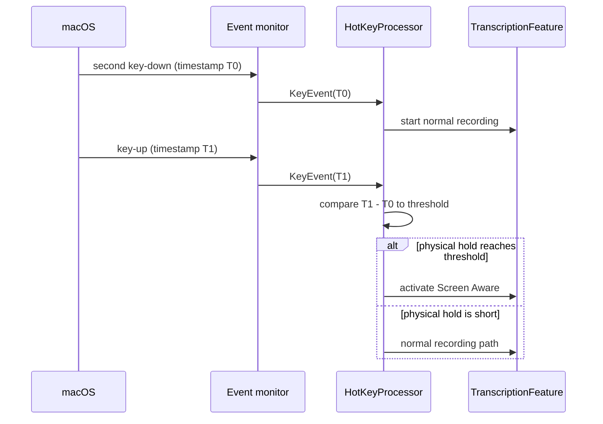

# Screen Aware Event Timestamping - Plan

## Goal Capsule

- **Objective:** Decide whether a held second hotkey activation qualifies for Screen Aware from the physical macOS event timestamps rather than when Octo processes those events.
- **Authority:** Preserve the configured Screen Aware threshold and all unrelated hotkey gestures.
- **Stop conditions:** Do not move the event tap off the main run loop or redesign general hotkey handling.
- **Execution profile:** Add focused regression coverage but do not run tests unless explicitly requested; use the project Debug build for verification.

---

## Product Contract

### Summary

The plan makes Screen Aware activation wait for a physically measured long second press, so a key-up delayed by main-thread load remains a normal recording gesture.

### Problem Frame

Screen Aware currently relies on processing-time `Date` values and an asynchronous countdown.
When the main run loop is delayed after key-down, a physically short key-up can be handled after the threshold and be misclassified as a long hold.

### Requirements

- R1. Preserve the macOS `CGEvent` timestamp on every keyboard `KeyEvent` received by the live event monitor.
- R2. Evaluate the held second-tap duration from the physical key-down and key-up timestamps when both are present and ordered.
- R3. Activate Screen Aware only after a second-tap release whose physical duration meets `ScreenAwareActivation.holdDuration(for:)`.
- R4. Keep normal recordings normal when their physical hold duration is below the threshold, even if the app processes key-up after the threshold.
- R5. Retain existing double-tap locking, terminal-refinement, and ordinary press-and-hold behavior.

### Scope Boundaries

- Do not move keyboard monitoring to a dedicated run loop.
- Do not change the configured threshold or introduce a new user setting.
- Do not add persistent hotkey timing telemetry in this change.

---

## Planning Contract

### Key Technical Decisions

- KTD-1. Carry the `CGEventTimestamp` as an unsigned event-time value on `KeyEvent`; CoreGraphics documents it as roughly nanoseconds since startup, so deltas are monotonic and are not affected by wall-clock changes.
- KTD-2. Make the core `HotKeyProcessor` authoritative for second-tap physical duration, using event timestamps for live events while retaining the existing `Date` calculation only for timestamp-less synthetic compatibility paths.
- KTD-3. Remove the pre-release Screen Aware countdown path. A long second tap is confirmed at key-up, which prevents a delayed reducer action from activating Screen Aware before the physical release can be evaluated.

### Assumptions

- The user accepts Screen Aware becoming visible after key-up rather than immediately at the threshold; this is the behavior tradeoff selected in the request.
- The live monitor always supplies timestamps. Timestamp-less synthetic events retain the legacy `Date` calculation, while an unexpected backwards timestamp is non-qualifying.

### High-Level Technical Design

### Sources & Research

- `HexCore/Sources/HexCore/Models/KeyEvent.swift` retains phase and physical key data but not timestamps today.
- `Hex/Clients/KeyEventMonitorClient.swift` converts the live `CGEvent` and attaches the tap to the main run loop.
- `HexCore/Sources/HexCore/Logic/HotKeyProcessor.swift` currently determines second-tap hold length from processing-time `Date` values.
- `Hex/Features/Transcription/TranscriptionFeature.swift` currently uses a cancellable threshold effect for pre-release activation.
- The local CoreGraphics SDK defines `CGEventTimestamp` as roughly nanoseconds since startup.

---

## Implementation Units

### U1. Preserve physical keyboard event time

- **Goal:** Make live keyboard event time available to hotkey logic without disturbing existing synthetic test events.
- **Files:** `HexCore/Sources/HexCore/Models/KeyEvent.swift`, `Hex/Clients/KeyEventMonitorClient.swift`.
- **Approach:** Add an optional/defaulted timestamp to `KeyEvent` and populate it from the incoming `CGEvent` in the live initializer.
- **Test scenarios:** Synthetic test events can omit a timestamp; live conversion exposes the supplied event timestamp.

### U2. Classify second-tap Screen Aware holds by physical duration

- **Goal:** Replace processing-time second-tap duration classification with the physical event-time delta.
- **Files:** `HexCore/Sources/HexCore/Logic/HotKeyProcessor.swift`, `HexCore/Tests/HexCoreTests/HotKeyProcessorTests.swift`.
- **Approach:** Store the second tap's key-down timestamp, calculate the duration at its key-up, and route a qualifying release to the existing Screen Aware intent while clearing timestamp state on every reset path. Use the legacy `Date` path only when synthetic inputs omit a timestamp, and treat a backwards timestamp as non-qualifying.
- **Test scenarios:** A 0.74-second second tap remains a normal lock/recording; a 0.75-second second tap qualifies; a short timestamped release processed after an advanced injected `Date` still remains normal; missing timestamps preserve synthetic test compatibility; reset, cancellation, and backwards timestamps do not leak or qualify a previous timestamp.

### U3. Remove pre-release activation and cover reducer integration

- **Goal:** Ensure Screen Aware no longer starts from the asynchronous threshold before physical key-up.
- **Files:** `Hex/Features/Transcription/TranscriptionFeature.swift`, `HexTests/RecordingRaceTests.swift`, `docs/hotkey-semantics.md`.
- **Approach:** Remove the screen-aware activation timer/actions and map the processor's confirmed Screen Aware output into the existing reducer activation flow. Update gesture documentation to say the physical hold is evaluated on release.
- **Test scenarios:** Advancing the screen-aware clock before release does not activate Screen Aware; a confirmed long-release intent activates it; the normal release path remains unchanged.

### U4. Record the user-visible fix

- **Goal:** Include the behavior change in release notes.
- **Files:** `.changeset/<generated>.md`.
- **Approach:** Add a patch changeset stating that Screen Aware recognizes the physical hotkey hold duration.
- **Test expectation:** None; release metadata only.

---

## Verification Contract

| Check | Applies to | Done signal |
|---|---|---|
| Focused XCTest/TCA regression coverage | U1-U3 | Tests compile and assert physical timestamp behavior. Execution is deliberately skipped unless the user requests tests. |
| Debug build | U1-U4 | `xcodebuild -scheme Octo -configuration Debug -skipMacroValidation -skipPackagePluginValidation CODE_SIGNING_ALLOWED=NO build` succeeds. |
| Diff review | U1-U4 | Only the timestamp path, Screen Aware release decision, documentation, tests, and changeset change. |

---

## Definition of Done

- R1-R5 are implemented with timestamps as the Screen Aware second-tap duration authority.
- A delayed app-side key-up cannot make a physically short second press qualify for Screen Aware.
- Existing unrelated worktree changes are untouched.
- Focused tests are added but not executed without explicit user authorization.
- The Debug build succeeds and a patch changeset is present.
