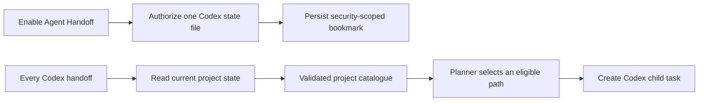

# feat: Authorize Codex project-catalog routing

## Summary

Ask once for read access to Codex's project-state file when Agent Handoff is enabled. Before every Codex handoff, re-read that file, derive current project candidates, and require the planner to route only to one of those candidates.

## Problem Frame

The existing planner infers a project from arbitrary directories beneath a broad workspace. It cannot distinguish a real Codex project from an unrelated repository or know that a project is intentionally development-only.

## Requirements

- R1. Enabling Agent Handoff requests one-time, read-only access to `~/.codex/.codex-global-state.json`.
- R2. A cancellation or unavailable file leaves Agent Handoff disabled and explains the setup failure.
- R3. Each Codex handoff resolves the bookmark and reads the latest file before planning.
- R4. The planner receives only current, validated project candidates within the already authorized discovery workspace and must choose one of them.
- R5. Codex state is never written.

## Key Technical Decisions

- Store a security-scoped bookmark for the exact state file, not the whole `.codex` directory.
- Parse the app's current project order and thread-to-project assignments in native code; the LLM receives structured candidates rather than raw private state.
- Preserve the existing discovery-workspace boundary for child-task execution. Registry entries outside it are not eligible until their workspace is separately authorized.

## High-Level Technical Design

## Implementation Units

### U1. Authorize and read the Codex project-state file

**Goal:** Persist narrowly scoped read access and project it into current local project candidates.

**Requirements:** R1, R3, R5.

**Dependencies:** None.

**Files:** `Hex/Clients/AgentHandoffClient.swift`; `HexTests/AgentHandoffClientTests.swift`.

**Approach:** Add a security-scoped file bookmark, a main-actor authorization flow for the Settings toggle, and a deterministic JSON projection from project order, labels, and thread assignments. Re-resolve and read it for every planner run.

**Test scenarios:** Parse ordered projects with a path and fallback display name; prefer an explicit workspace label; ignore projects without an existing local path; reject unavailable bookmarks.

**Verification:** The projected catalogue contains only current, eligible filesystem paths and no operation writes to Codex state.

### U2. Gate setup and routing on the current catalogue

**Goal:** Ensure user setup obtains the required access and that planning cannot fall back to arbitrary directories.

**Requirements:** R2, R4.

**Dependencies:** U1.

**Files:** `Hex/Features/Settings/RefinementSectionView.swift`; `Hex/Clients/AgentHandoffClient.swift`; `HexTests/AgentHandoffClientTests.swift`.

**Approach:** Replace the direct handoff toggle binding with an authorization-backed binding. Supply the current eligible catalogue to the planner prompt and validate its selected path against the catalogue as well as the discovery root.

**Test scenarios:** Planner guidance includes catalogue candidates; a path inside the workspace but absent from the catalogue is rejected; a denied setup keeps the toggle off.

**Verification:** Enabling handoffs completes only after authorization, and every Codex planning request receives refreshed project candidates.

## Scope Boundaries

- Claude handoffs remain unchanged.
- Octo does not write or repair Codex's private state.
- Project paths outside the existing authorized discovery workspace remain unavailable for child-task creation.

## Verification Contract

- Add focused unit coverage for catalogue parsing and planner-path validation.
- Build the unsigned Debug app with the repository-prescribed command; tests remain opt-in.

## Definition of Done

- The Agent Handoff toggle obtains and retains a bookmark for the exact Codex project-state file.
- Each Codex handoff reads the current project catalogue and cannot select a non-catalogue workspace.
- Codex state remains read-only and setup failures are actionable.
