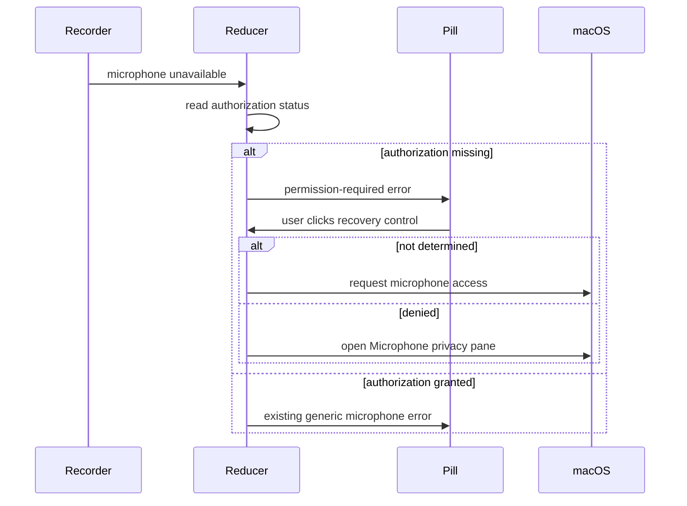

# fix: Make missing microphone permission actionable

## Goal Capsule

- **Objective:** When recording cannot start because microphone authorization is missing, show an explicit recording-pill error that the user can click to invoke the native permission flow.
- **Authority:** The requested pill behavior and native system permission interaction take precedence; existing generic recording failures and unrelated pill interactions remain unchanged.
- **Execution profile:** Add a permission-specific reducer state and action, route that state through the existing overlay, and protect the behavior with focused reducer and view-state tests.
- **Stop conditions:** Stop if macOS exposes no supported prompt or Settings route through the existing permission client, or if the implementation would require changing unrelated recording gestures.
- **Tail ownership:** Add a patch changeset; repository rules reserve test and build execution for explicit user authorization.

---

## Product Contract

### Summary

Octo should explain when microphone permission, rather than microphone hardware, prevents recording. The error pill should act as the recovery control: clicking it asks macOS for access when consent is still undecided and opens the Microphone privacy pane when macOS cannot show the prompt again.

### Problem Frame

Recording startup currently collapses all microphone-unavailable failures into a generic error. The user cannot tell that authorization is the cause, and clicking a generic error opens History instead of helping recover permission.

### Requirements

- R1. A microphone-unavailable startup result with missing authorization shows a permission-specific error in the recording pill.
- R2. Clicking the permission-specific error invokes the native microphone request while authorization is not determined.
- R3. Clicking the same error after authorization has been denied opens the system Microphone privacy pane because macOS does not re-display the consent prompt.
- R4. A microphone-unavailable startup result with granted authorization keeps the existing generic hardware error behavior.
- R5. Other pill states retain their current tap destinations and presentation lifecycles.
- R6. The permission pill displays “Microphone access required — click to grant access” and exposes button semantics, activation, and an accessibility hint for the same recovery action.

### Scope Boundaries

- In scope: microphone authorization detection after a microphone-unavailable startup result, actionable pill presentation, native request/Settings fallback, tests, and a changeset.
- Out of scope: requesting permission proactively at launch, changing hotkeys, retrying recording automatically after consent, or redesigning unrelated error pills.

### Acceptance Examples

- AE1. Given microphone access has never been requested, when recording reports the microphone unavailable, then the pill says microphone permission is required and clicking it triggers the native consent dialog.
- AE2. Given microphone access was denied, when the permission error pill is clicked, then Octo opens the system Microphone privacy pane and leaves recovery under user control.
- AE3. Given microphone access is granted but recording still reports the microphone unavailable, then Octo shows the existing generic microphone-unavailable error rather than a permission prompt.

---

## Planning Contract

### Key Technical Decisions

- KTD1. Classify authorization after either unsuccessful recording-start result. Missing authorization produces the actionable pill for both `.microphoneUnavailable` and backend `.failed`; granted authorization preserves the existing generic handling for `.microphoneUnavailable` and the existing silent handling for cancelled or superseded `.failed` starts. Successful starts avoid the extra permission check.
- KTD2. Keep `State.error` as the existing display string and add a separate permission-actionability flag. This minimizes churn in existing error handling and tests while allowing the overlay to select a distinct status and tap action.
- KTD3. Keep the permission error visible until recovery or a subsequent recording attempt rather than applying the generic five-second expiry. An actionable recovery control must remain available long enough to use.
- KTD4. Use the existing `PermissionClient` methods. Request access only from `.notDetermined`; for `.denied`, open the existing Microphone Settings deep link; for `.granted`, dismiss stale permission UI.

### High-Level Technical Design

### Assumptions

- “Missing permission” includes `.notDetermined` and `.denied`; `.denied` requires a Settings fallback because macOS does not show the native question twice.
- Granting permission does not automatically restart the interrupted recording. The next hotkey press starts a fresh recording under the existing flow.
- The current first-click AppKit hosting and panel interaction remains the input mechanism; no new window behavior is needed.

---

## Implementation Units

### U1. Classify and recover microphone authorization failures

- **Goal:** Represent a permission-caused recording failure distinctly and handle its recovery action through the existing permission dependency.
- **Requirements:** R1, R2, R3, R4; AE1, AE2, AE3.
- **Dependencies:** None.
- **Files:** `Hex/Features/Transcription/TranscriptionFeature.swift`, `HexTests/RecordingRaceTests.swift`.
- **Approach:** Inject `PermissionClient`; after either unsuccessful recording-start result, branch on microphone status. Missing authorization enters the permission flow; granted authorization preserves the generic `.microphoneUnavailable` path and existing silent `.failed` behavior. Add reducer actions for the persistent permission error, pill click, and response cleanup. When a new recording begins, clear both the error message and permission-actionability flag and cancel any stale generic error-expiry effect; generic errors and dismissal also clear actionability.
- **Patterns to follow:** Existing `recordingStartFailed`, `showError`, cancellable error presentation, and dependency-driven Settings permission requests.
- **Test scenarios:**
  - Covers AE1. A microphone-unavailable start with `.notDetermined` enters the permission-specific state without scheduling generic expiry.
  - A backend `.failed` start with `.denied` also enters the permission-specific state instead of leaving the user without recovery.
  - Covers AE3. A microphone-unavailable start with `.granted` still receives the generic recording-start failure and “Microphone not available” error.
  - A cancelled or superseded `.failed` start with `.granted` keeps its existing silent behavior.
  - Covers AE1. Clicking while `.notDetermined` calls `requestMicrophone`; a granted response clears the error.
  - Covers AE2. Clicking while `.denied` calls `openMicrophoneSettings` without calling `requestMicrophone`.
  - A generic error clears any stale permission-actionability flag.
  - A subsequent recording attempt removes the persistent permission pill and cannot be dismissed by an older generic error-expiry effect.
- **Verification:** Reducer state and dependency probes demonstrate each authorization branch without changing the ordinary recording-success path.

### U2. Route the actionable error through the recording pill

- **Goal:** Present a clear microphone-permission message and make that status invoke recovery instead of opening History.
- **Requirements:** R1, R2, R3, R5, R6; AE1, AE2.
- **Dependencies:** U1.
- **Files:** `Hex/Features/Transcription/TranscriptionIndicatorView.swift`, `HexTests/TranscriptionFallbackPresentationTests.swift`.
- **Approach:** Add a permission-specific indicator status with the fixed message “Microphone access required — click to grant access” and a recovery callback. Give it tap priority ahead of the generic open-History behavior, expose it as an accessible button with an action-specific hint and activation action, and map the overlay’s permission flag to that status and reducer action while preserving all existing handoff, transcript, copied, waveform, and generic error interactions.
- **Patterns to follow:** Existing status-derived geometry, accessibility labels, callback injection, and overlay action routing.
- **Test scenarios:**
  - The permission-required status identifies itself as actionable and does not use the History tap path.
  - Generic `.error` remains non-permission-specific and keeps its existing interaction.
  - The permission state maps to the fixed user-facing message and exposes button semantics, the recovery activation action, and an action-specific accessibility hint.
- **Verification:** The status mapping, accessibility label, and tap routing are explicit and covered independently of AppKit window behavior.

### U3. Record the user-facing fix

- **Goal:** Add the required release-note fragment without processing pending changesets.
- **Requirements:** R1, R2.
- **Dependencies:** U1, U2.
- **Files:** `.changeset/*.md`.
- **Approach:** Create a patch changeset summarizing that the recording pill now explains missing microphone permission and offers recovery.
- **Patterns to follow:** Existing `.changeset` fragments and the repository’s non-interactive changeset script.
- **Test expectation:** None — release metadata only.
- **Verification:** A new patch fragment exists and no changelog/version processing has run.

---

## Verification Contract

| Gate | Applies to | Done signal |
|---|---|---|
| Focused reducer coverage | U1 | Authorization-not-determined, denied, and granted branches have explicit assertions and dependency-call probes. |
| Focused indicator coverage | U2 | The permission status and generic error status have distinct routing assertions. |
| Static source validation | U1, U2 | Modified Swift files parse successfully and `git diff --check` reports no whitespace errors. |
| Repository test/build policy | U1, U2 | Tests and local builds are not executed unless the user explicitly authorizes them; this exception is reported in the handoff. |
| Release metadata | U3 | One new patch changeset describes the user-facing behavior. |

---

## Definition of Done

- A permission-caused microphone startup failure produces a persistent, explicit error pill.
- Clicking that pill requests native consent when possible and opens the Microphone privacy pane after denial.
- Granted authorization still routes hardware failure to the existing generic error.
- Other pill taps and recording flows remain unchanged.
- Focused tests encode the new branches, modified Swift parses, and the required patch changeset exists.
