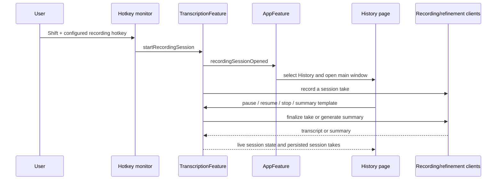

# Recording Sessions - Plan

## Goal Capsule

- **Objective:** Make Shift plus the configured recording hotkey begin a persistent recording session in History instead of the transient recording pill.
- **User experience:** The session page controls recording, pause/resume, and stop; shows microphone and optional system-audio timelines; exposes per-session Speaker ID and System Audio toggles; and switches between a transcript and AI-generated summaries.
- **Scope boundary:** Keep the regular History list and ordinary recording hotkey behavior intact. This is the first session-focused page, not the later full History information-architecture redesign.
- **Verification constraint:** This repository permits no local Debug build or tests unless explicitly requested. Use static diff inspection only in this implementation turn.

## Product Contract

### Requirements

- **R1:** When the configured recording hotkey does not itself contain Shift, pressing Shift plus that exact hotkey from idle begins a session recording and opens the main app on History. The ordinary hotkey remains unchanged.
- **R2:** A live session has a default title formatted as `Recording: <localized date and time>` and remains visible through pause/resume and final stop until the user returns to the normal History list.
- **R3:** The session header presents record/resume or pause first, a separate stop control, the title beneath the controls, and Speaker ID plus System Audio toggles at the right.
- **R4:** A session shows one microphone timeline and, when enabled, a second system-audio timeline. The timeline affordance follows live meter state while recording.
- **R5:** Transcript and Summary are tabs. Transcript deliberately displays a waiting state during active recording; once paused or stopped it aggregates completed session takes.
- **R6:** Summary defaults to a concise meeting-style template. Hovering the Summary tab exposes a template menu; selecting a template invokes the existing refinement provider against the session transcript and presents result/error state.
- **R7:** Pausing finalizes and transcribes a take; resuming creates another take in the same session. Each take retains optional session metadata in History so the live session can aggregate it.
- **R8:** Speaker ID and System Audio are session-local settings, snapshotted for each take just as ordinary settings are today. They can be changed between takes without mutating global settings or a running take.
- **R9:** Existing Shift terminal gestures for agent handoff, normal/refined recordings, retention, recovery, and system-audio persistence stay intact.

### Assumptions

- A configured hotkey that already includes Shift has no unambiguous extra-Shift session variant and therefore continues with its existing behavior.
- System-audio capture does not currently expose a live meter; the system timeline indicates capture progress and uses the session’s live cadence rather than claiming a separate measured audio level.
- The existing refinement provider and configured model are the initial summary engine; this change does not introduce a new provider or a settings screen for summary templates.

## High-Level Design

## Implementation Units

### U1. Persist session membership on individual History takes

- **Files:** `HexCore/Sources/HexCore/Models/TranscriptionHistory.swift`, `HexCore/Tests/HexCoreTests/TranscriptionHistoryTests.swift`.
- **Approach:** Add optional session ID and title fields to `Transcript`, preserving backward-compatible decoding. Add a round-trip test for the metadata.
- **Verification:** Legacy transcript JSON remains decodable; session metadata survives an encode/decode round trip.

### U2. Model and drive the session lifecycle in transcription

- **Files:** `Hex/Features/Transcription/TranscriptionFeature.swift`.
- **Approach:** Introduce session state (ID, title, per-session capture options, recording/paused/stopped phase, selected summary template, generated summary/error). Recognize Shift plus an otherwise exact start chord before the ordinary `HotKeyProcessor` consumes it. Start session takes without a release-triggered stop; route pause, resume, stop, option changes, and summary generation through explicit actions. Attach session metadata when durable History checkpoints are made, aggregate completed take text for summary generation, and snapshot session capture options per take.
- **Verification:** Static reducer review confirms ordinary hotkeys remain on their established paths and only an unambiguous extra-Shift chord starts a session.

### U3. Route the session to the History window

- **Files:** `Hex/Features/App/AppFeature.swift`, `Hex/App/Notifications.swift` if a dedicated notification name improves clarity.
- **Approach:** Handle the session-open action from the child feature by selecting History and posting through the existing main-window presentation mechanism.
- **Verification:** Static routing review confirms that a running app tab changes and a closed main app window is requested to open.

### U4. Present the live recording session inside History

- **Files:** `Hex/Features/History/HistoryFeature.swift`, `Hex/Features/App/AppFeature.swift`.
- **Approach:** Pass the scoped transcription store to `HistoryView`. When session state exists, render a focused `RecordingSessionView` instead of restructuring the regular History list. Add header controls, capture toggles, audio timelines, transcript/summary tabs, hover-only template menu, waiting/processing/error states, and a return-to-History action. Aggregate transcript rows by session ID.
- **Verification:** Static SwiftUI review checks that controls map to existing reducer actions, both one/two-stream layouts are covered, and transcript visibility follows phase.

### U5. Record the user-facing feature

- **Files:** `.changeset/*.md`.
- **Approach:** Add a patch changeset using the repository’s non-interactive script, describing Shift-started History recording sessions.
- **Verification:** The generated fragment names the user-facing behavior.

## Definition of Done

- An unambiguous Shift-start chord opens the History session view and starts a first take without changing ordinary recording.
- Pause/resume produces multiple takes under one session and stop finalizes the session UI.
- The page renders the requested controls, channel timelines, transcript waiting state, and selectable generated summaries.
- Session metadata remains compatible with old History files and the feature includes a changeset.
